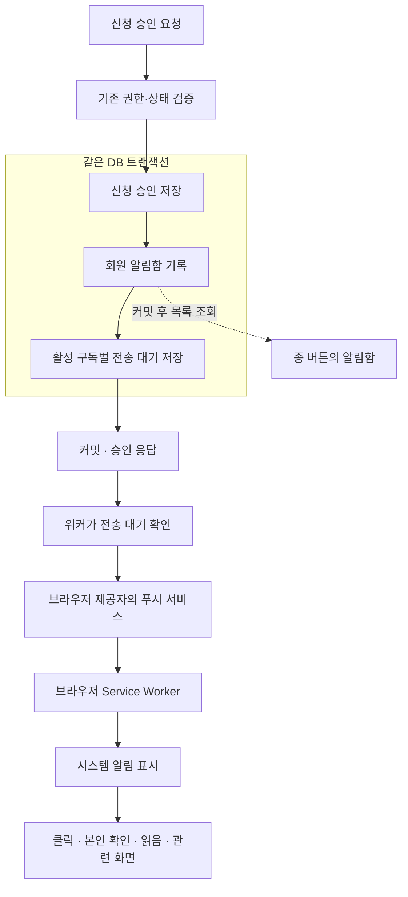

# ADR 0015. 알림함에 소식을 저장하고 웹푸시는 별도로 전송한다

- 상태: **채택 — 백엔드 알림함·구독·웹푸시 전송 구현, 화면·실기기 연결 전**
- 날짜: 2026-10-02
- 작성 목적: 웹푸시 업무 담당자가 선택한 구조와 그 이유를 팀에 공유한다.
- 결정 범위: 알림 저장, 브라우저 구독, 푸시 전송과 실패 처리의 구조
- 관련 결정: [백엔드 ADR 0008 · CQRS-lite 협업 경계](0008-cqrs-lite-collaboration-boundary.md),
  [백엔드 ADR 0011 · PostgreSQL 선택](0011-postgresql-rdbms-selection.md)
- 관련 규칙: [아키텍처](../conventions/architecture.md), [영속성](../conventions/persistence.md),
  [인증·API 공통 계약](../context/api/common-contract.md)
- 구현 계약: [데이터 모델](../context/domain/model/notification.md),
  [알림 API](../context/api/endpoints/notifications.md),
  [단계별 구현·검증](../../../docs/web-push-implementation.md) (구현 완료 후 진행표와 이 링크 삭제)

## 이 업무에서 선택한 구조

**신청·승인 같은 소식은 자리하나 DB의 알림함에 먼저 남기고, 브라우저 푸시는 별도 작업으로 보낸다.**
알림함은 회원당 같은 사건을 한 번 기록하고, 푸시는 그 회원이 허용한 모든 브라우저에 각각 전송한다.

예를 들어 신청이 승인되면 사용자의 알림함에 “신청이 승인되었습니다”가 남는다.
사용자가 휴대폰과 노트북에서 푸시를 허용했다면 두 브라우저 모두에 알린다.
노트북 전송이 실패해도 승인 결과와 알림함 기록은 유지하고, 노트북 전송만 다시 시도한다.

이 문서는 업무 담당자가 선택한 구현 방식, 선택 이유, 동작 흐름과 감수할 비용을 기록한다.
아래 구조는 백엔드 코드에 반영했다. 브라우저 화면·Service Worker와 실제 제공자의 수신·클릭은
후속 단계에서 연결하고 검증한다. API와 SQL은 연결된 상세 문서에서 확인할 수 있다.

## 배경: 알림함과 웹푸시는 역할이 다르다

사용자는 자리하나를 열어 두지 않아도 신청 결과를 알고 싶어 한다.
또한 푸시를 허용하지 않았거나 푸시를 놓쳤더라도 서비스 안에서 결과를 다시 확인할 수 있어야 한다.

| 구분 | 사용자에게 제공하는 것 | 저장·처리 기준 |
| --- | --- | --- |
| 알림함 | 프로필 옆 종 버튼으로 확인하는 소식 목록 | 회원 계정 |
| 웹푸시 | 휴대폰·컴퓨터의 시스템 알림으로 새 소식을 알려 줌 | 푸시를 허용한 브라우저 구독 |

웹푸시는 네트워크, 브라우저 지원, 권한 설정 등에 영향을 받는다.
따라서 푸시 성공 여부로 알림함 기록을 만들거나 지우면 소식을 확인할 기회가 달라진다.
**알림함을 소식의 기록으로 두고, 푸시를 그 기록을 확인하도록 알려 주는 수단으로 둔다.**

PWA는 웹을 홈 화면에 설치하고 앱처럼 실행하도록 제공하는 기반이다.
웹푸시는 브라우저의 Push API와 Service Worker를 이용한다. Service Worker는 페이지와 별도로
푸시 수신·알림 표시·클릭 처리를 맡는 브라우저 코드다.
설치와 푸시 허용은 서로 다른 단계이며, 지원 조건은 환경마다 다르다. 예를 들어 iPhone의
지원 환경에서는 홈 화면에 추가한 웹앱과 사용자 동작에 따른 권한 요청이 필요하다.
환경별 지원은 기능 감지와 실기기 테스트로 확인한다.
[WebKit 공식 설명](https://webkit.org/blog/13878/web-push-for-web-apps-on-ios-and-ipados/)

## 제품에서 정한 동작

아래 사용자 동작을 기준으로 저장·전송 구조를 정했다.

- PWA 설치·푸시 허용 여부와 관계없이 해당 회원의 알림함에 소식을 남긴다.
- 푸시를 허용한 활성 브라우저 구독 모두에 전송한다. 첫 번째 전송 성공에서 멈추지 않는다.
- 종 버튼으로 알림함을 여는 것만으로 읽음 처리하지 않는다.
- 개별 알림을 선택하면 읽음 처리하고 관련 신청·모집 화면으로 이동한다.
- **전체 읽음은 읽음 표시만 바꾸고, 항목은 목록에 남긴다.**
- **삭제 성공 때만 해당 항목이 슬라이드하며 사라진다.** 삭제는 신청·그룹 데이터에 영향을 주지 않는다.

알림 대상은 현재 코드가 실제 수행하는 사건이다.

| 사건 | 수신자 |
| --- | --- |
| 승인제 모집의 새 신청 | 사건 발생 당시 모임장 |
| 자동 승인 모집의 새 참여 | 사건 발생 당시 모임장 |
| 수동·자동 승인 결과 | 신청자 |
| 모임장의 수동 미승인 결과 | 신청자 |
| 재모집·그룹 종료에서 실제 수행한 시스템 미승인 | 해당 신청자 |

자동 승인 참여는 모임장의 새 참여 알림과 신청자의 승인 결과 알림을 각각 만든다.
현재 정원 도달·정원 수정에 따른 마감은 기존 대기 신청을 유지하므로, 이 경우 시스템 미승인
알림을 만들지 않는다. 재모집·종료도 현재 코드가 실제 미승인한 신청만 대상으로 삼는다.

## 사용자가 푸시를 켜고 소식을 받기까지

| 단계 | 브라우저가 하는 일 | 서버가 하는 일 |
| --- | --- | --- |
| 처음 푸시 켜기 | 사용자 버튼 동작으로 권한을 요청하고, Service Worker와 브라우저 구독을 준비한다. 수신 주소와 암호화 키를 서버에 등록한다. | 인증된 회원과 브라우저 구독을 연결해 저장한다. |
| 알림 사건 발생 | 페이지를 열어 두지 않아도 지원 환경에서 푸시를 받을 수 있다. | 업무 결과·알림함·전송 대기를 저장하고, 워커가 해당 수신 주소의 푸시 서비스로 전송한다. |
| 푸시 수신·클릭 | Service Worker가 연결 확인과 시스템 알림 표시를 맡는다. 클릭하면 자리하나를 연다. | 현재 로그인 회원의 본인 알림인지 확인하고, 읽음 처리와 관련 화면 이동에 필요한 정보를 제공한다. |

사용자가 푸시를 허용하지 않았다면 첫 단계의 구독이 없다.
이때도 사건 발생 시 알림함 기록은 생성되며, 사용자가 자리하나를 방문해 종 버튼으로 확인할 수 있다.

## 구조를 이렇게 나눈 이유

### 1. 업무 결과·알림·전송 대기를 하나의 DB 작업으로 저장한다

신청 승인을 예로 들면 다음 세 가지를 **같은 트랜잭션**으로 저장한다.
트랜잭션은 여러 DB 변경을 모두 성공시키거나 모두 취소하는 묶음이다.

1. 신청을 승인 상태로 변경한다.
2. 신청자의 알림함에 승인 알림 한 건을 저장한다.
3. 신청자의 활성 브라우저 구독마다 푸시 전송 대기 기록을 저장한다.

이렇게 하면 “승인은 완료됐는데 서버가 꺼져 알림 기록이 없는 상태”를 방지할 수 있다.
세 가지 중 하나의 DB 저장이 실패하면 승인 변경도 함께 취소한다.
푸시를 허용한 구독이 없다면 1·2만 저장한다.

업무 서비스가 사건을 발행하면 알림 기능의 동기 리스너가 커밋 전에 기록을 저장하도록 설계했다.
Spring의 `@TransactionalEventListener(BEFORE_COMMIT)`를 사용하고,
이 리스너에서 별도 비동기 실행이나 새 트랜잭션을 시작하지 않는다. 동일 트랜잭션에서의 저장과
실패 시 전체 취소는 통합 테스트로 확인한다.
[Spring 공식 설명](https://docs.spring.io/spring-framework/reference/data-access/transaction/event.html)

### 2. 실제 푸시는 DB 저장 이후 워커가 전송한다

외부 푸시 서비스에 요청하는 작업은 승인 처리 중에 실행하지 않는다.
**워커**는 DB에 저장한 전송 대기를 찾아 처리하는 서버의 백그라운드 작업이다.
우선 기존 Spring 애플리케이션 안에서 실행한다.

“나중에 외부로 보낼 작업을 DB에 먼저 저장한다”는 방식을 **Transactional Outbox**라고 한다.
이 구조에서는 아래 `notification_deliveries`가 전송 대기를 맡는다.
외부 전송을 기다리는 동안 DB 트랜잭션이나 잠금을 유지하지 않는다.

푸시 서비스가 느리거나 실패해도 이미 커밋한 승인과 알림함 기록은 유지된다.
서버가 재시작하면 DB에 남은 작업부터 다시 처리할 수 있다.

### 3. 세 종류의 데이터를 나누어 관리한다

| 테이블 | 저장하는 내용 | 승인 알림 한 건·활성 구독 두 개일 때 |
| --- | --- | --- |
| `notifications` | 수신 회원, 사건 종류·내용, 읽음·삭제 시각 | 알림 한 행 |
| `push_subscriptions` | 브라우저의 수신 주소·암호화 키, 연결 회원, 활성 여부 | 기존 구독 두 행 사용 |
| `notification_deliveries` | 어떤 알림을 어느 구독에 보낼지, 시도 횟수·전송 결과 | 전송 작업 두 행 |

브라우저 구독은 “이 브라우저가 푸시를 받을 주소와 키”다.
같은 휴대폰에서도 브라우저나 설치본이 다르면 구독이 다를 수 있으므로 물리적 기기 수로 관리하지 않는다.

알림 한 건을 여러 구독에 보내더라도 알림함에는 한 번만 나온다.
읽음은 계정 기준으로 공유하고, 푸시 전송 결과는 구독마다 다르게 기록한다.
반복 처리가 같은 알림이나 같은 구독의 전송 작업을 늘리지 않도록 DB 유일 제약을 둔다.

이 셋을 한 기록으로 합치면 “휴대폰 전송은 수락됐지만 노트북 전송은 실패했고,
사용자는 아직 읽지 않았다”는 상태를 표현하기 어렵다.
각각 다른 질문에 답하도록 나누었다: **어떤 소식인가, 어디로 보낼 것인가, 어디까지 전송했는가.**

구독별 작업은 사건을 저장할 때의 활성 구독을 기준으로 만든다.
이후 새로 푸시를 켰다고 과거 알림을 일괄 전송하지 않는다.
전송 전에 해당 구독이 해제되었거나 계정 연결이 바뀌었으면 그 작업을 취소한다.

### 4. 실패한 구독만 제한적으로 재시도한다

암호화와 VAPID 서명은 [zerodep-web-push-java](https://github.com/st-user/zerodep-web-push-java)의
2.1.5 버전에 맡겼다. Java 21에서 요청 암호문 복호화와 서명을 검증했다.
실제 HTTP 연결은 Apache HttpClient 5로 처리한다. DNS 검사에서 허용한 공개 주소를 실제 연결에도
사용하고, 원래 호스트의 TLS 검증을 유지하기 위해 주소 해석기를 연결 경계에 지정했다.
외부 HTTP는 redirect·자동 재시도를 허용하지 않으며, 제한시간이 지나면 요청 자체를 취소한다.
재시도 횟수와 일정은 DB의 구독별 전송 작업이 관리한다.

| 같은 승인 알림의 대상 | 첫 전송 결과 | 다음 처리 |
| --- | --- | --- |
| 휴대폰 브라우저 | 푸시 서비스가 수락 | 완료 기록, 일반적인 재전송 없음 |
| 노트북 브라우저 | 일시적인 통신 오류 | 이 구독의 작업만 재시도 |
| 사용자의 알림함 | 승인 알림 저장 완료 | 전송 결과와 관계없이 그대로 유지 |

전송 상태는 대기 → 처리 중 → 수락으로 진행한다.
일시 실패는 재시도, 영구 실패·시도 상한 도달은 실패, 구독 해제·알림 삭제 등은 취소로 종료한다.
워커가 여러 개 실행돼도 같은 작업을 동시에 처리하지 않도록 DB에서 작업을 선점하고,
워커가 중단되면 일정 시간이 지난 뒤 다른 워커가 이어받게 한다.
이전 워커의 늦은 응답이 새 처리 결과를 덮어쓰지 못하도록 선점 식별자도 검증한다.

초기 설정은 최초 전송을 포함해 최대 5회, 재시도 간격 5초부터 증가, 작업 유효기간 24시간으로 잡았다.
외부 서비스가 더 늦은 재시도를 요구하면 그 시간을 존중한다.
오래된 소식을 계속 전송하거나 장애 상황에서 무한히 요청하지 않도록 상한을 두었다.
이 수치는 설정으로 관리하고 실제 전송 테스트와 부하 측정 결과에 따라 조정한다.

푸시 서비스의 “수락”은 실제 기기 표시나 사용자 열람을 뜻하지 않는다.
따라서 전송 상태를 읽음 상태로 바꾸지 않는다.
[RFC 8030의 전송 수락 설명](https://www.rfc-editor.org/rfc/rfc8030.html#section-5)

외부 서비스가 수락한 직후 서버가 꺼져 결과를 DB에 남기지 못하면 재전송이 발생할 수 있다.
같은 알림 식별자를 이용해 중복 표시를 완화하되, 정확히 한 번 도착한다고 보장하지 않는다.

### 5. 읽음·삭제는 알림함 상태로 처리한다

읽음은 읽은 시각을 기록하고 목록에 남긴다.
전체 읽음은 화면에 불러온 한 페이지만이 아니라 해당 회원의 처리 대상 전체를 갱신한다.
그 처리 이후 새로 들어온 알림은 안 읽음으로 남긴다.

삭제는 기존 영속성 규칙에 따라 삭제 시각을 기록하는 **soft delete**로 정했다.
일반 목록에서 제외하므로 새로고침·재로그인·다른 브라우저에서도 다시 나타나지 않는다.
이미 삭제한 같은 사건을 다시 처리해도 알림이 부활하지 않도록 중복 방지 기준을 유지한다.
삭제된 행도 사건의 중복 방지 기준에 포함하여, 삭제 후 재처리가 새 알림을 만들지 않게 한다.

삭제 성공 후에만 화면에서 해당 행을 슬라이드 퇴장시킨다.
삭제 요청이 실패하면 행을 유지하고 재시도를 제공한다.
아직 끝나지 않은 푸시 작업은 취소하지만, 이미 외부 서비스가 수락한 푸시를 회수한다고 보장하지 않는다.

### 6. 계정이 바뀐 브라우저에서 이전 계정의 정보를 보호한다

푸시 수신 대상 회원은 서버의 인증 정보로 결정한다.
클라이언트가 회원 번호를 보내 다른 회원의 구독·알림을 조회하거나 수정할 수 없게 한다.

로그아웃할 때는 현재 브라우저의 연결을 정리한다. 다른 브라우저의 연결까지 모두 해제하지 않는다.
계정 연결이 바뀔 때 연결 버전을 변경하고, 과거 연결 버전으로 만든 전송 작업을 무효화하도록
설계했다. 브라우저도 로그아웃 시 이전 계정 연결과 알림함 캐시를 정리한다.

서버의 접근 권한은 회원 계정 기준으로 확인하고, 브라우저 연결은 구독 번호와 연결 버전으로
구분한다. 별도 구독용 비밀값을 추가 발급하는 절차는 두지 않는다. 이 방식은 같은 회원의
여러 브라우저 중 실제 요청 브라우저를 서버가 따로 증명하지 않으며, UI가 현재 브라우저의
구독을 선택한다. 회원 소유권 확인은 서버가 매 요청 수행한다.

#### 이전 계정의 상세 알림을 표시하지 않는 방법

OS 알림에는 신청 본문·미승인 사유 등 민감한 내용을 넣지 않는다.
이전 계정으로 보낸 푸시가 늦게 도착하는 경우를 고려해, 푸시에는 알림 식별자와 연결 정보만 보내고
Service Worker가 현재 연결과 인증을 확인한 뒤 사건 종류·문구를 얻도록 설계했다.
푸시 본문에는 알림 번호·구독 번호·연결 버전·내용 형식 번호만 담는다.
Service Worker는 조회 응답을 받은 뒤에도 현재 연결을 다시 확인한다. 로그아웃·계정 전환으로
연결이 바뀌었다면 이전 요청의 응답을 상세 알림 표시에 사용하지 않는다.
확인이 불가능하면 상세 내용을 노출하지 않는 일반 안내를 사용한다.
추가 조회와 로그인 만료·오프라인 처리가 필요하므로, 이 방식의 실제 브라우저 동작은 출시 전에 검증한다.

푸시 클릭 후에도 현재 로그인 회원의 알림인지 서버에서 다시 확인한다.
본인 알림이면 읽음 처리 후 관련 화면으로 이동한다. 로그인 필요 시 기존 로그인 복귀 흐름을 활용한다.
대상이 삭제되었거나 권한이 바뀌었으면 안내 후 알림함으로 돌아간다.

## 다른 방식 대신 이 구조를 선택한 이유

| 대안 | 장점 | 비용·위험 | 선택 판단 |
| --- | --- | --- | --- |
| 승인 요청 안에서 바로 푸시 전송 | 흐름이 단순함 | 외부 지연이 승인 응답에 영향. 외부 전송과 DB 변경을 함께 취소할 수 없음 | 업무와 외부 전송의 실패 경계가 맞지 않아 제외 |
| 커밋 후 메모리 이벤트만으로 전송 | DB 테이블이 적고 응답이 빠름 | 커밋 직후 서버가 꺼지면 알림·전송 작업을 잃을 수 있음 | 재시작 후 이어서 처리할 기록이 필요해 제외 |
| 알림함 + 구독 + 구독별 전송 대기 | 기존 DB에서 원자적 저장·부분 실패·재시작 처리 가능 | 구독 수만큼 업무 트랜잭션의 INSERT가 늘어남 | **선택한 구조** |
| 별도 사건 Outbox를 추가하고 워커가 구독별 작업 생성 | 업무 요청에서 대량 전송 작업 생성을 분리할 수 있음 | 테이블·확장 상태 증가. 사건 당시 구독을 별도로 기억해야 함 | 구독 수가 커져 현재 방식의 비용이 문제가 되면 재검토 |
| Kafka 등 메시지 브로커 도입 | 독립 소비자·큰 처리량에 유리 | 새 운영 요소 추가. DB와 메시지의 원자성 문제도 별도 해결 필요 | 현재 단일 앱·DB 범위에서는 도입 비용이 커 보류 |

## 이 선택으로 얻는 것과 감수하는 비용

푸시를 거부하거나 놓친 사용자도 알림함에서 결과를 확인할 수 있다.
전송 장애가 승인 결과를 되돌리지 않으며, 여러 브라우저의 부분 실패를 개별적으로 처리할 수 있다.
별도 메시지 서버 없이 기존 PostgreSQL과 Spring 애플리케이션에서 시작할 수 있다.

대신 테이블 세 개와 워커, 브라우저 구독·계정 연결 관리가 추가된다.
알림 기록의 DB 저장 실패는 원 업무도 실패시키며, 활성 구독이 많아지면 업무 트랜잭션의 저장 비용이
늘어난다. 구독 수별 요청 시간을 측정하고, 비용이 커지면 별도 사건 Outbox로 확장하는 대안을 검토한다.
전송 중복·지연·미도착 가능성과 soft delete 기록의 누적도 운영에서 관리해야 한다.

기존 [백엔드 ADR 0008](0008-cqrs-lite-collaboration-boundary.md)의 단일 앱·DB와 command/query
경계를 유지한다. 알림함은 같은 트랜잭션에서 기록하므로 별도 비동기 조회 모델을 만들지 않는다.
이 ADR에서 정한 비동기 처리는 외부 푸시 전송에 한정한다.

## 구현하면서 확인할 동작 경계

1. **원자성:** 알림 저장 실패는 업무·알림·전송 대기 전체를 취소하고, 외부 전송 실패는 업무·알림을 유지한다.
2. **현행 정책:** 정원 마감의 대기 신청 유지와 재모집·종료의 실제 미승인 대상을 보존한다.
3. **다중 구독:** 실패한 구독만 재시도하고, 같은 사건의 알림함 기록은 한 건이다.
4. **읽음·삭제:** 전체 읽음은 항목을 유지하며 이후 새 알림은 안 읽음이다. 삭제 성공에만 행이 사라진다.
5. **복구:** 워커의 동시 처리·중단·재시작·늦은 응답이 새 전송 결과를 덮어쓰지 않는다.
6. **계정 보호:** 여러 브라우저 구독이 있어도 현재 브라우저의 구독 정보로 해제·로그아웃하며 다른
   브라우저의 연결은 유지한다. 로그아웃 실패·계정 전환·늦은 푸시·클릭에서 이전 회원의 상세 정보를 노출하지 않는다.
7. **환경:** 지원 브라우저·모바일 설치 환경에서 백그라운드 수신, 표시, 클릭·로그인 복귀를 확인한다.
8. **운영:** SQL 적용 후 스키마 검증, 비밀키 설정, Service Worker 배포·갱신, 전송 실패 관측을 확인한다.

이 문서는 구조와 선택 이유를 기록한다. 단계별 코드 검증 결과는
테스트와 실기기 확인을 통해 남긴다.
오래된 알림의 자동 삭제·휴지통·전체 삭제·추가 업무 알림·업무 스케줄러는 이번 구현 범위에 포함하지 않는다.
