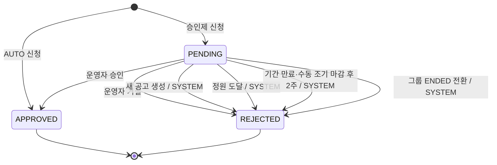

# 비즈니스 정책

> 상태: 저장소 최신 설계 기준
>
> 구현·테스트·Swagger/OpenAPI와 충돌하면 임의로 해석하지 않고 차이를 보고한다.

이 문서는 요청이나 이벤트가 발생했을 때 시스템이 수행해야 하는 업무 처리 흐름을 정리한다. 모델의 필드·값 유효성은 `model/` 아래 상세 문서에서, 모델 간 항상 유지되어야 하는 관계는 `invariants.md`에서 다룬다.

## 회원 가입과 탈퇴

- GitHub 인증만 완료한 단계에는 `Member`를 만들지 않고, 크루명·과정과 일반 회원의 경우 기수를 입력한 뒤 생성한다. 따라서 프로필이 비어 있는 `Member`는 존재하지 않는다.
- 탈퇴 시 닉네임 익명화와 재가입 정책은 추후 결정한다.

## 모집 방식별 정책

| 구분 | 신청 단계 | 확정 단계 |
| --- | --- | --- |
| `AUTO` | 남은 자리가 있으면 신청 가능. | 신청 즉시 `APPROVED` 및 `GroupMember` 생성 |
| `APPROVAL` | `capacity`보다 많은 `PENDING` 신청 허용 | 운영자 승인 시 `capacity` 검증 후 `GroupMember` 생성 |

승인제에서 대기 신청은 `capacity`에 포함하지 않으며 승인된 인원 수를 기준으로 판단한다.

## 신청 상태 전이



- `PENDING` 신청 철회는 상태 전이가 아니라 `Registration`을 Hard Delete하는 행위다.
- `APPROVED` 또는 `REJECTED` 신청은 철회할 수 없다.
- 수동 승인·거절의 `decidedBy`는 실제 결정을 수행한 `MEMBER(memberId)`로 기록한다.
- 자동 거절의 `decidedBy`는 `SYSTEM`으로 기록하고 UI에는 `System`으로 표시한다.
- 마감 후 2주 자동 거절의 사전 알림 기능은 MVP에 포함하지 않고 추후 검토한다.

## 그룹 생성과 소속

- 그룹 생성과 동시에 모임장의 `GroupMember(role = LEADER)`를 생성한다.

## 모집 공고의 계산 상태

```plain text
endsAt IS NULL              상시 모집
now < startsAt              모집 예정
startsAt <= now < endsAt    모집 중
endsAt <= now               마감
```

- 조기 마감은 `startsAt = min(startsAt, now)`, `endsAt = now`로 처리한다.
- 한 번 마감된 공고는 다시 활성화하지 않는다. 재모집은 새 공고를 생성한다.
- 모집 공고는 수정하거나 삭제할 수 없으며 종료만 가능하다.
- 새 공고를 생성하면 같은 그룹의 기존 활성 공고를 마감하고, 해당 공고의 `PENDING` 신청을 `SYSTEM` 주체로 즉시 `REJECTED` 처리한다.
- 승인 인원이 `capacity`에 도달하면 `endsAt`을 현재 시각으로 변경하여 공고를 자동 마감하고, 남아 있는 `PENDING` 신청을 `SYSTEM` 주체로 즉시 `REJECTED` 처리한다.
- 정원 미달 상태에서 공고 기간이 만료된 경우 기존 `PENDING` 신청은 즉시 거절하지 않고 마감 후 2주 정책을 적용한다.

## 그룹 삭제 정책
그룹 삭제는 그룹과 연관 데이터를 물리적으로 제거하는 독립된 도메인 명령이다.

| 구분 | 정책 |
| --- | --- |
| 가능 조건 | `ACTIVE`이며 그룹 생성 후 24시간 이내 |
| 처리 | 그룹 데이터를 Hard Delete한다. `Group.status`는 변경하지 않는다 |
| 연관 데이터 | 모집 공고, 신청, 구성원, 일정을 함께 삭제한다 |
| 종료 기능 | 삭제가 가능한 동안에는 종료할 수 없다 |
| 사용자 화면 | 삭제 기능만 활성화하고 종료 기능은 제공하지 않는다 |

- Hard Delete 전에 “신청자 N명의 이력도 함께 삭제됩니다”라는 경고와 신청자 수를 보여 준다.
- 생성 후 24시간이 지나면 삭제 기능은 비활성화한다.
- 삭제 요청을 종료 요청으로 자동 전환하지 않는다.

## 그룹 종료 정책
그룹 종료는 활동의 생명주기를 끝내고 이력을 보존하는 독립된 도메인 명령이다.

| 구분 | 정책 |
| --- | --- |
| 가능 조건 | `ACTIVE`이며 그룹 생성 후 24시간 초과 |
| 처리 | `Group.status`를 `ACTIVE`에서 `ENDED`로 변경한다 |
| 연관 데이터 | 그룹, 모집 공고, 신청, 구성원, 일정 이력을 보존한다 |
| 모집 공고와 대기 신청 | 마감되지 않은 공고를 마감하고 `PENDING` 신청을 `SYSTEM` 주체로 즉시 거절한다 |
| 삭제 기능 | 종료가 가능한 시점에는 삭제할 수 없다 |
| 사용자 화면 | 종료 기능만 활성화하고 삭제 기능은 제공하지 않는다(삭제 기능은 비활성화된 UI로) |

- `ACTIVE` 그룹에서만 모집 생성, 그룹 수정, 신청, 신청자 승인·거절 등의 변경 행위를 수행할 수 있다.
- `ENDED` 그룹은 다시 `ACTIVE`로 전환할 수 없다.
- `ENDED` 그룹은 기본 탐색 목록에서 제외하고 별도 종료 목록에서만 조회한다.
- `ENDED` 그룹에서는 과거 그룹·모집·신청·구성원·일정 조회만 허용한다.
- 모집 생성, 그룹 수정, 신청, 신청자 승인·거절을 포함한 모든 변경 행위를 금지한다.
- 삭제와 종료를 하나의 메뉴 항목이나 조건에 따라 처리만 달라지는 단일 버튼으로 표현하지 않는다.

## 모임장 이탈 정책
모임장이 그룹 또는 서비스를 이탈하려면 다른 구성원에게 모임장 역할을 반드시 위임해야 한다.
- 그룹에서 이탈할 때는 해당 `GroupMember`를 Hard Delete한다.
- 위임은 기존 모임장과 새 모임장의 `role`을 맞바꾸는 하나의 원자적 행위이며, 도중에 `LEADER`가 0명 또는 2명이 되는 상태를 허용하지 않는다.
