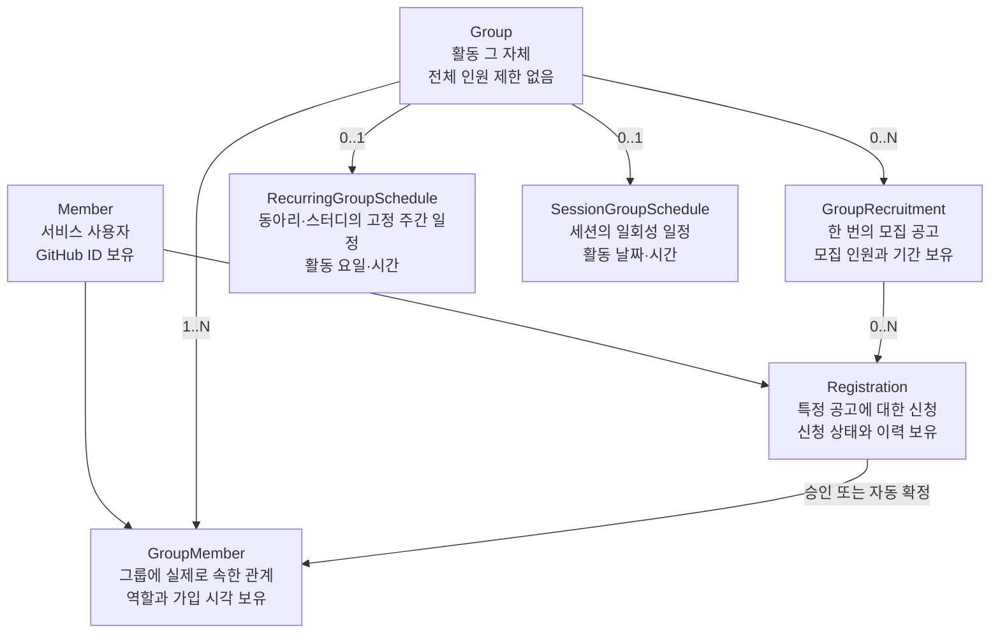
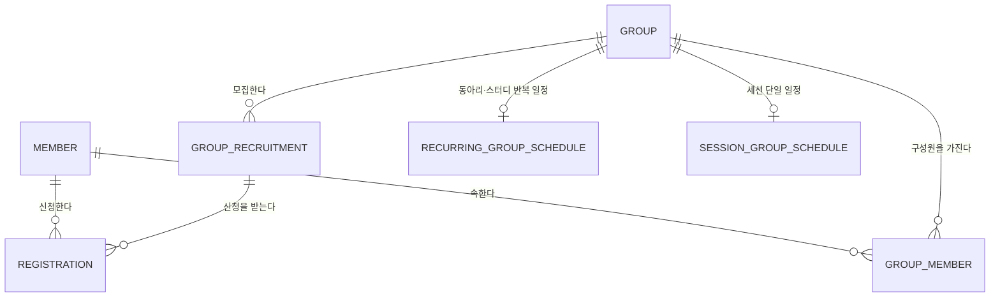
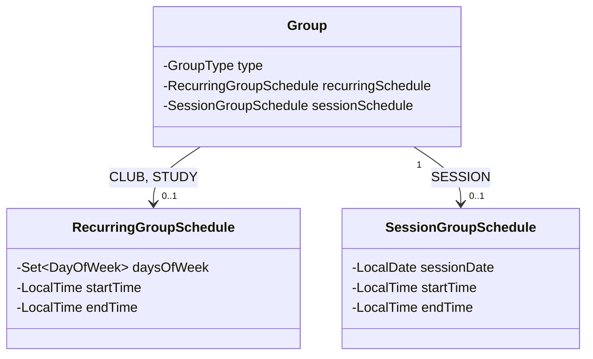

# 도메인 모델

> 상태: Notion 설계 맥락 스냅샷
>
> 원본: [Notion 문서](https://app.notion.com/p/3ba0978a6e6c81f89deed43d644c762d)
>
> 동기화: 2026-08-15
>
> 구현·테스트·Swagger/OpenAPI와 충돌하면 임의로 해석하지 않고 차이를 보고한다.

## 도메인 액터

| 액터 | 설명 | 주요 행위 |
| --- | --- | --- |
| 탐색 크루 | 참여할 활동을 찾는 서비스 사용자 | 목록 탐색, 상세 조회, 가입 신청, 신청 취소 |
| 운영 크루 | 활동을 개설하고 운영하는 서비스 사용자 | 그룹 개설, 모집 공고 등록, 신청 심사, 모임장 위임, 그룹 삭제 |

한 사용자가 두 역할을 모두 수행할 수 있다. 역할은 `Member` 자체의 속성이 아니라 특정 그룹과의 관계이므로 `GroupMember.role`로 표현한다.

## 핵심 도메인 구조



핵심 구분은 다음과 같다.
- `Member`는 자리하나 서비스 사용자이며 GitHub ID를 직접 보유한다.
- `Group`은 활동 자체이며 전체 인원 제한을 갖지 않는다.
- `GroupRecruitment`는 특정 시점의 한 번의 모집이며 모집 인원과 기간을 갖는다.
- `Group`과 `GroupRecruitment`는 1:N 관계다. 새 공고가 생성되면 같은 그룹의 기존 활성 공고를 마감하고 해당 공고의 `PENDING` 신청을 `SYSTEM` 주체로 즉시 `REJECTED` 처리한다. 가장 최신 공고만 마감되지 않은 상태로 둔다.
- `Registration`은 특정 모집 공고에 대한 신청과 의사결정 이력이다.
- `GroupMember`는 운영자 승인 또는 `AUTO` 방식의 자동 승인 결과로 만들어지는 실제 소속 관계다.
- 일정은 `RecurringGroupSchedule`과 `SessionGroupSchedule`로 분리하며 두 클래스 사이에 상속 관계를 두지 않는다.
- `CLUB`, `STUDY`는 `recurringSchedule`만 사용할 수 있다. 값이 없으면 활동 요일과 시간이 고정되지 않은 **유동적 일정**이다.
- `SESSION`은 `sessionSchedule`을 반드시 가지며 `recurringSchedule`은 가질 수 없다.
- 두 일정이 동시에 존재할 수 없다.
- `RecurringGroupSchedule`은 선택한 여러 활동 요일과 하나의 시작·종료 시간을 매주 동일하게 적용한다.
- `SessionGroupSchedule`은 하나의 활동 날짜와 시작·종료 시간을 가진다.
이 분리를 통해 같은 그룹이 시기별로 여러 번 모집하거나, 모집이 끝난 뒤에도 활동을 계속하거나, 모집 공고 없이 과거 활동을 보존하는 구조를 표현할 수 있다.

## 용어

| 도메인 용어 | 코드 | 정의 |
| --- | --- | --- |
| 회원 | `Member` | 자리하나 서비스의 사용자 |
| 그룹 | `Group` | 동아리, 스터디 또는 일회성 세션 등 활동의 단위 |
| 모집 공고 | `GroupRecruitment` | 그룹이 사람을 모집하는 한 번의 공고 |
| 신청 | `Registration` | 회원이 특정 모집 공고에 제출한 참여 요청 |
| 그룹 구성원 | `GroupMember` | 회원과 그룹 사이의 실제 소속 관계 |
| 모임장 | `GroupMemberRole.LEADER` | 그룹의 현재 운영 책임자. 위임 시 변경될 수 있다 |
| 그룹 삭제 | Hard Delete | 생성 후 24시간 이내에만 가능한 물리 삭제다. 그룹과 연관 데이터를 실제로 제거하며 상태 전이를 일으키지 않는다 |
| 그룹 종료 | `Group.status = ENDED` | 생성 후 24시간이 지나 삭제할 수 없는 `ACTIVE` 그룹에만 가능한 생명주기 종료다. 데이터를 보존한다 |
| 마감 | `GroupRecruitment.endsAt` | 모집이 끝났음을 기간으로 판단한다 |

그룹 삭제와 그룹 종료는 하나의 요청이 시간에 따라 다르게 처리되는 기능이 아니라 서로 다른 도메인 명령이다. 삭제할 수 있는 동안에는 종료할 수 없고, 삭제할 수 없게 된 이후에는 종료만 가능하다. 모집 공고의 마감 역시 그룹 종료와 다른 개념이다.

## 엔티티 목록과 생명주기

| 엔티티 | 역할 | 생명주기 |
| --- | --- | --- |
| `Member` | GitHub ID를 포함한 서비스 사용자 | 가입부터 탈퇴까지. MVP에는 탈퇴 기능이 없다 |
| `Group` | 동아리, 스터디 또는 세션 | 개설 시 `ACTIVE`. 생성 후 24시간 이내에는 삭제만 가능하고, 24시간이 지나면 종료만 가능하다. 종료 시 `ENDED`로 전환 |
| `GroupRecruitment` | 한 번의 모집 공고 | 등록부터 마감까지. 마감 후에도 이력으로 보존하며 새 공고 생성 시 기존 공고는 마감 |
| `RecurringGroupSchedule` | `CLUB`, `STUDY`의 매주 반복되는 고정 활동 요일과 시간 | 그룹에 선택적으로 하나만 존재한다. 값이 없으면 유동적 일정이며 그룹 Hard Delete 시 함께 삭제한다 |
| `SessionGroupSchedule` | `SESSION`의 한 번만 진행되는 활동 날짜와 시간 | 세션 그룹에 반드시 하나만 존재하며 그룹 Hard Delete 시 함께 삭제한다 |
| `Registration` | 모집 공고에 대한 가입 신청 | 상태를 변경하며 보존. 그룹을 Hard Delete할 때만 함께 삭제 |
| `GroupMember` | 그룹 소속과 역할 | 가입부터 이탈까지. 이탈 시 `GroupMember`를 Hard Delete |

## 관계도



- `Group`과 `GroupRecruitment`는 1:N 관계로 확정한다.
- `Group`은 유형에 따라 `RecurringGroupSchedule` 또는 `SessionGroupSchedule` 중 하나만 사용한다.
- `CLUB`, `STUDY`와 `RecurringGroupSchedule`은 선택적 1:1 관계다. 반복 일정이 없으면 유동적 일정이다.
- `SESSION`과 `SessionGroupSchedule`은 필수 1:1 관계다.
- 두 일정 클래스 사이에는 상속 관계가 없으며 한 그룹에 두 일정이 동시에 존재할 수 없다.
- `Registration`은 `Group`이 아니라 `GroupRecruitment`를 참조한다. 그래야 여러 차수의 모집 신청과 승인 인원을 공고별로 구분할 수 있다.
- `Registration`과 `GroupMember` 사이에는 직접 참조를 두지 않는 설계다. 모임장은 신청 없이 `GroupMember`가 되고, 재가입 시 어느 신청과 연결할지도 불명확하기 때문이다.
- 승인 이력과 소속 생성의 연결 추적이 실제 요구로 확인되면 `GroupMember.sourceRegistrationId`를 nullable로 추가하는 안을 다시 검토한다.

## 엔티티 구조와 필드

### Member

| 필드 | 타입 | 제약 | 설명 |
| --- | --- | --- | --- |
| `id` | Long | PK | 회원 식별자 |
| `crewName` | String | NOT NULL, 한글 2–4자, 공백·특수문자 불가 | 우테코 크루 닉네임 |
| `generation` | Integer | NOT NULL, 수정 불가 | 기수 |
| `githubId` | String | NOT NULL, UNIQUE | 변경되지 않는 GitHub 사용자 숫자 ID |
| `course` | Enum | NOT NULL | `BACKEND`, `FRONTEND`, `ANDROID` |
| `withdrawnAt` | LocalDateTime | nullable | 탈퇴 시각. MVP에는 탈퇴 기능이 없어 현재 사용하지 않음 |
| `joinedAt` | LocalDateTime | NOT NULL | 서비스 가입 시각 |
| `updatedAt` | LocalDateTime | NOT NULL | 최종 수정 시각 |

#### Member 정책과 검토 사항
- `crewName + generation` 조합은 유일하다.
- `crewName`은 완성형 한글 2–4자만 허용하며 공백과 특수문자는 허용하지 않는다.
- `generation`은 사용자가 수정할 수 없다. 잘못 입력한 경우 관리자 문의로 처리한다.
- 별도 `OauthAccount` 엔티티를 두지 않는다. GitHub 인증 정보 중 사용자 식별에 필요한 `githubId`를 `Member`가 직접 보유한다.
- GitHub 인증만 완료한 단계에는 `Member`를 만들지 않고, 크루명과 기수를 입력한 뒤 생성한다. 따라서 프로필이 비어 있는 `Member`는 존재하지 않는다.
- GitHub 프로필 이미지는 저장하지 않고 `githubId`로 아바타 URL을 구성한다.
- `course`는 MVP에 포함하며 `BACKEND`, `FRONTEND`, `ANDROID` 중 하나를 필수로 저장한다.
- 탈퇴 시 닉네임 익명화와 재가입 정책은 추후 결정한다.

### Group

| 필드 | 타입 | 제약 | 설명 |
| --- | --- | --- | --- |
| `id` | Long | PK | 그룹 식별자 |
| `type` | Enum | NOT NULL | `CLUB`, `STUDY`, `SESSION` |
| `meetingType` | Enum (`MeetingType`) | NOT NULL | 모임 진행 방식. `ONLINE`, `OFFLINE`, `FLEXIBLE` |
| `location` | String | nullable, 최대 255자 | 오프라인 모임 장소 또는 온라인 접속 정보 |
| `recurringSchedule` | RecurringGroupSchedule | `CLUB`, `STUDY` 전용, nullable | 매주 반복되는 고정 활동 요일·시간. 값이 없으면 유동적 일정 |
| `sessionSchedule` | SessionGroupSchedule | `SESSION`일 때 필수, 그 외 `null` | 한 번만 진행되는 세션의 활동 날짜·시간 |
| `name` | String | NOT NULL, UNIQUE, 1–50자 | 그룹 이름 |
| `introduction` | String | NOT NULL, 1–100자 | 카드에 표시하는 한 줄 소개 |
| `description` | String | nullable, 최대 5000자 | 상세 소개 |
| `representativeImageKey` | String | nullable | 이미지 URL이 아닌 스토리지 키 |
| `status` | Enum (`GroupStatus`) | NOT NULL, 기본값 `ACTIVE` | 그룹의 활동 상태. `ACTIVE`는 활동 중인 모임, `ENDED`는 종료된 모임 |
| `createdAt` | LocalDateTime | NOT NULL | 그룹 삭제 가능 여부와 종료 가능 여부를 판단하는 24시간 기준 |
| `updatedAt` | LocalDateTime | NOT NULL | 최종 수정 시각 |

#### GroupType

```javascript
CLUB     친목·취미 중심 동아리
STUDY    학습 중심 스터디
SESSION  한 번 진행하는 일회성 모임
```

#### MeetingType

```javascript
ONLINE   온라인으로 진행하는 모임
OFFLINE  오프라인으로 진행하는 모임
FLEXIBLE 고정된 온라인·오프라인 방식 없이 유동적으로 정하는 모임
```

`type`은 그룹 종류를, `meetingType`은 모임 진행 방식을 표현한다. 두 값은 서로 다른 의미를 가지며 `meetingType`이 `ONLINE`인 경우에도 `location`에는 접속 정보 등을 저장할 수 있다.

`meetingType`은 생성·수정 요청과 그룹 상세 응답에서 항상 포함한다. 기존 데이터에 `NULL`이 있다면 운영 반영 전에 `FLEXIBLE`로 보정한 뒤 `NOT NULL` 제약을 적용해야 한다.

```sql
UPDATE groups SET meeting_type = 'FLEXIBLE' WHERE meeting_type IS NULL;
ALTER TABLE groups ALTER COLUMN meeting_type SET NOT NULL;
```

#### GroupStatus

```javascript
ACTIVE   활동 중인 모임
ENDED    종료된 모임
```

- 그룹 생성 시 `status`는 `ACTIVE`다.
- `ACTIVE` 그룹만 모집 생성, 그룹 수정, 신청, 신청자 승인·거절 등의 변경 행위를 수행할 수 있다.
- `ENDED`로 전환된 그룹은 다시 `ACTIVE`로 되돌릴 수 없다.
- 그룹 전체 인원에는 제한을 두지 않는다. 모집할 인원 제한은 각 `GroupRecruitment`가 소유한다.
- 그룹 이름은 중복될 수 없다. 종료된 그룹의 이름 재사용 여부는 이 전역 유일성 정책에 따라 허용하지 않는 것으로 통합하되, 팀이 부분 유일성으로 바꾸려면 정책을 다시 결정해야 한다.
- 모임장은 `Group.leaderId`로 중복 저장하지 않고 `GroupMember.role = LEADER`로 표현한다.
- 그룹 삭제와 그룹 종료는 서로 다른 도메인 명령이며 한 시점에 하나만 가능하다.
- `createdAt`으로부터 24시간 이내의 `ACTIVE` 그룹은 삭제만 가능하며 종료할 수 없다.
- `createdAt`으로부터 24시간이 지난 `ACTIVE` 그룹은 삭제할 수 없으며 종료만 가능하다.
- 삭제는 그룹과 연관 데이터를 Hard Delete하며 `status`를 변경하지 않는다.
- 종료는 `status`를 `ACTIVE`에서 `ENDED`로 변경하고 그룹과 연관 이력을 보존한다.
- `status = ENDED`인 그룹은 기본 탐색 목록에서 제외하고 별도 종료 목록에서만 조회한다.
- `ENDED` 그룹은 다시 `ACTIVE`로 전환할 수 없으며, 모집 생성·그룹 수정·신청·신청자 승인·거절을 포함한 모든 변경 행위를 금지한다.
- `ENDED` 그룹에서는 과거 그룹·모집·신청·구성원·일정 이력 조회만 허용한다.
- `CLUB`, `STUDY`는 `recurringSchedule`만 사용할 수 있고 `sessionSchedule`은 반드시 `null`이어야 한다.
- `CLUB`, `STUDY`의 `recurringSchedule`이 없으면 활동 요일과 시간이 고정되지 않은 유동적 일정으로 해석한다.
- `SESSION`은 `sessionSchedule`을 반드시 가져야 하고 `recurringSchedule`은 반드시 `null`이어야 한다.
- `recurringSchedule`과 `sessionSchedule`은 동시에 존재할 수 없다.
- `RecurringGroupSchedule`과 `SessionGroupSchedule` 사이에는 상속 관계나 공통 일정 부모 타입을 두지 않는다.

### GroupRecruitment

| 필드 | 타입 | 제약 | 설명 |
| --- | --- | --- | --- |
| `id` | Long | PK | 모집 공고 식별자 |
| `groupId` | Long | NOT NULL, FK | 모집을 진행하는 그룹 |
| `joinMethod` | Enum | NOT NULL | `AUTO`, `APPROVAL` |
| `capacity` | Integer | NOT NULL, 1 이상 | 이 모집 공고에서 모집할 인원의 제한 |
| `startsAt` | LocalDateTime | NOT NULL | 모집 시작 시각 |
| `endsAt` | LocalDateTime | nullable | 모집 종료 시각. `null`이면 상시 모집 |
| `createdAt` | LocalDateTime | NOT NULL | 공고 생성 시각 |
| `updatedAt` | LocalDateTime | NOT NULL | 최종 수정 시각 |

#### 모집 공고 모델 규칙
- `RecruitmentStatus` 필드를 저장하지 않는다. 모집 예정·모집 중·마감·상시 모집 여부는 기간으로 계산한다.
- 조기 마감은 `endsAt`을 현재 시각으로 앞당기는 행위다. 미래의 `startsAt`보다 앞서게 만들지 않도록 `startsAt = min(startsAt, now)`, `endsAt = now`로 처리한다.
- 기간 불변식은 `startsAt <= endsAt`이다. 즉시 마감 시 두 값이 같을 수 있다.
- 그룹 전체 정원에는 인원 제한이 없다. 각 모집 공고에는 이번에 모집할 인원을 제한하는 `capacity`를 반드시 둔다.
- `AUTO`는 남은 정원이 있을 때 신청 즉시 자동 승인된다. 모든 모집 공고는 1 이상의 `capacity`를 필수로 가진다.
- `APPROVAL`은 `capacity`를 초과해 신청을 받을 수 있지만, 승인된 인원은 `capacity`를 초과할 수 없다.
- `AUTO` 신청 승인 또는 `APPROVAL` 운영자 승인으로 승인 인원이 `capacity`에 도달하면 `endsAt`을 현재 시각으로 변경하여 공고를 자동 마감한다.
- 승인 인원이 `capacity`에 도달해 공고가 자동 마감되면 남아 있는 `PENDING` 신청을 `SYSTEM` 주체로 즉시 `REJECTED` 처리한다.
- `Group`과 `GroupRecruitment`는 1:N 관계다.
- 새 모집 공고가 생성되면 같은 그룹의 기존 활성 공고를 마감하고 해당 공고의 `PENDING` 신청을 `SYSTEM` 주체로 즉시 `REJECTED` 처리한다. 따라서 한 그룹에서는 가장 최신 공고만 마감되지 않은 상태일 수 있다.
- 모집 공고는 수정하거나 삭제할 수 없으며 종료만 가능하다.

## 일정 구조



### RecurringGroupSchedule

`CLUB`, `STUDY`의 고정 주간 일정을 표현한다.

| 필드 | 타입 | 제약 | 설명 |
| --- | --- | --- | --- |
| `daysOfWeek` | `Set<DayOfWeek>` | NOT NULL, 1개 이상 | 매주 활동하는 요일 |
| `startTime` | LocalTime | NOT NULL | 활동 시작 시각 |
| `endTime` | LocalTime | NOT NULL, `startTime < endTime` | 활동 종료 시각 |

### SessionGroupSchedule

`SESSION`의 일회성 일정을 표현한다.

| 필드 | 타입 | 제약 | 설명 |
| --- | --- | --- | --- |
| `sessionDate` | LocalDate | NOT NULL | 세션 진행 날짜 |
| `startTime` | LocalTime | NOT NULL | 세션 시작 시각 |
| `endTime` | LocalTime | NOT NULL, `startTime < endTime` | 세션 종료 시각 |

### 일정 모델 규칙

- `RecurringGroupSchedule`과 `SessionGroupSchedule` 사이에는 상속 관계를 두지 않는다.
- `CLUB`, `STUDY`는 `recurringSchedule`만 사용할 수 있다. 값이 없으면 유동적 일정이다.
- `SESSION`은 `sessionSchedule`을 반드시 가져야 한다.
- 두 일정은 동시에 존재할 수 없다.
- 두 일정 모두 `startTime < endTime`을 만족해야 한다.
- `RecurringGroupSchedule.daysOfWeek`는 하나 이상의 요일을 가져야 한다.

### Registration

| 필드 | 타입 | 제약 | 설명 |
| --- | --- | --- | --- |
| `id` | Long | PK | 신청 식별자 |
| `recruitmentId` | Long | NOT NULL, FK | 신청 대상 모집 공고 |
| `memberId` | Long | NOT NULL, FK | 신청한 `Member` |
| `message` | String | nullable, 최대 1000자 | 신청 메시지 |
| `status` | Enum | NOT NULL | `PENDING`, `APPROVED`, `REJECTED` |
| `rejectReason` | String | nullable, 최대 1000자 | 거절 사유 |
| `registeredAt` | LocalDateTime | NOT NULL | 신청 시각 |
| `decidedAt` | LocalDateTime | nullable | 승인 또는 거절 시각 |
| `decidedBy` | DecisionActor | `PENDING`이면 nullable, 결정 후 NOT NULL | 수동 결정은 `MEMBER(memberId)`, 자동 거절은 `SYSTEM` |

### Registration 모델 규칙

- 신청 대상은 그룹이 아니라 모집 공고다.
- 한 회원은 하나의 모집 공고에 한 번만 신청할 수 있다.
- 승인/거절된 경우, 같은 공고에 재신청할 수 없다.
- 신청자는 신청을 철회할 수 있다. 철회는 Hard Delete를 의미한다.
- 이미 상태가 정해진 경우(거절 또는 승인) 사용자는 철회할 수 없다.
- 수동 승인·거절의 `decidedBy`는 실제 결정을 수행한 `MEMBER(memberId)`로 기록한다.
- 마감 후 2주 경과에 따른 자동 거절 상황과 그룹의 `status = ENDED` 전환 시 대기 상태인 신청은 거절 처리한다. 그때 `decidedBy = SYSTEM`으로 기록하고 UI에는 `System`으로 표시한다.

### GroupMember

| 필드 | 타입 | 제약 | 설명 |
| --- | --- | --- | --- |
| `id` | Long | PK | 그룹 소속 식별자 |
| `groupId` | Long | NOT NULL, FK | 소속 그룹 |
| `memberId` | Long | NOT NULL, FK | 소속 회원 |
| `role` | Enum | NOT NULL | `LEADER`, `MEMBER` |
| `joinedAt` | LocalDateTime | NOT NULL | 그룹 가입 시각 |

- 그룹 생성과 동시에 모임장의 `GroupMember(role = LEADER)`를 생성한다.
- `Registration`은 신청 사건 이력이고 `GroupMember`는 실제 소속 상태이므로 분리한다.
- 그룹에서 나갈 때 Hard Delete한다.
- 추후 그룹 내 게시판 같은 기능이 생긴다면 `GroupPost`는 `GroupMember`가 아닌 `Member`를 참조한다.
- 현재 모임장은 다른 활성 구성원을 후임 모임장으로 지정한 뒤에만 그룹 또는 서비스에서 이탈할 수 있다.
- 위임은 기존 모임장과 새 모임장의 `role`을 맞바꾸는 하나의 원자적 행위이며, 도중에 활성 `LEADER`가 0명 또는 2명이 되는 상태를 허용하지 않는다.
---
