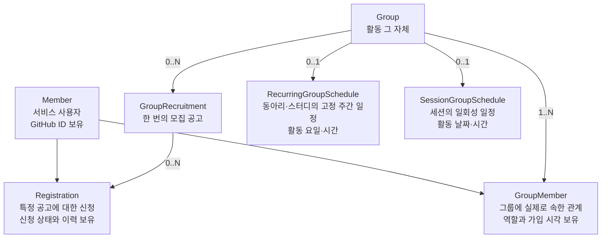
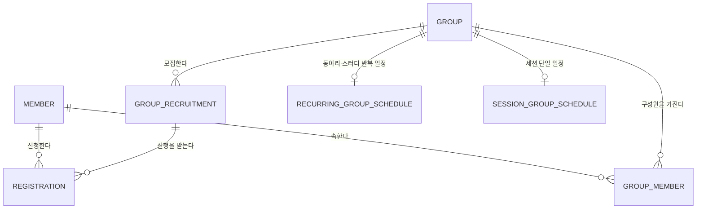

# 도메인 모델

> 상태: 저장소 최신 설계 기준
>
> 구현·테스트·Swagger/OpenAPI와 충돌하면 임의로 해석하지 않고 차이를 보고한다.

## 도메인 액터

| 액터 | 설명 | 주요 행위 |
| --- | --- | --- |
| 탐색 크루 | 참여할 활동을 찾는 서비스 사용자 | 목록 탐색, 상세 조회, 가입 신청, 신청 취소 |
| 운영 크루 | 활동을 개설하고 운영하는 서비스 사용자 | 그룹 개설, 모집 공고 등록, 신청 심사, 모임장 위임, 그룹 삭제 |

한 사용자가 두 역할을 모두 수행할 수 있다. 역할은 `Member` 자체의 속성이 아니라 특정 그룹과의 관계이므로 `GroupMember.role`로 표현한다.

## 핵심 도메인 구조

핵심 구분은 다음과 같다.
- `Member`는 자리하나 서비스 사용자이며 GitHub ID를 직접 보유한다.
- `Group`은 동아리, 스터디 또는 세션 활동 자체다.
- `GroupRecruitment`는 그룹에 속한 한 번의 모집 공고다.
- `Registration`은 특정 모집 공고에 대한 신청과 의사결정 이력이다.
- `GroupMember`는 회원과 그룹 사이의 실제 소속 관계다.
- 일정은 `RecurringGroupSchedule`과 `SessionGroupSchedule`이라는 서로 다른 모델로 표현한다.
이 분리를 통해 같은 그룹이 시기별로 여러 번 모집하거나, 모집이 끝난 뒤에도 활동을 계속하거나, 모집 공고 없이 과거 활동을 보존하는 구조를 표현할 수 있다.

## 용어

| 도메인 용어 | 코드 | 정의 |
| --- | --- | --- |
| 회원 | `Member` | 자리하나 서비스의 사용자 |
| 그룹 | `Group` | 동아리, 스터디 또는 일회성 세션 등 활동의 단위 |
| 모집 공고 | `GroupRecruitment` | 그룹이 사람을 모집하는 한 번의 공고 |
| 신청 | `Registration` | 회원이 특정 모집 공고에 제출한 참여 요청 |
| 그룹 구성원 | `GroupMember` | 회원과 그룹 사이의 실제 소속 관계 |
| 모임장 | `GroupMemberRole.LEADER` | 그룹의 현재 운영 책임자. 위임 시 변경될 수 있다 |
| 그룹 삭제 | Hard Delete | 그룹과 연관 데이터를 물리적으로 제거하는 명령 |
| 그룹 종료 | `Group.status = ENDED` | 그룹 활동을 종료하고 이력을 보존하는 상태 전환 |
| 마감 | `GroupRecruitment.endsAt` | 모집 종료를 표현하는 값 |

## 엔티티 목록과 생명주기

| 엔티티 | 역할 | 생명주기 |
| --- | --- | --- |
| `Member` | GitHub ID를 포함한 서비스 사용자 | 가입과 탈퇴를 표현한다 |
| `Group` | 동아리, 스터디 또는 세션 | `ACTIVE`와 `ENDED` 상태를 가진다 |
| `GroupRecruitment` | 한 번의 모집 공고 | 등록 후 마감되는 생명주기를 가진다 |
| `RecurringGroupSchedule` | `CLUB`, `STUDY`의 반복 일정 | 그룹에 연결되는 일정 모델이다 |
| `SessionGroupSchedule` | `SESSION`의 일회성 일정 | 세션 그룹에 연결되는 일정 모델이다 |
| `Registration` | 모집 공고에 대한 가입 신청 | `PENDING`, `APPROVED`, `REJECTED` 상태를 가진다 |
| `GroupMember` | 그룹 소속과 역할 | 회원과 그룹 사이의 소속 상태를 표현한다 |

## 관계도

- `Registration`은 `Group`이 아니라 `GroupRecruitment`를 참조한다. 그래야 여러 차수의 모집 신청과 승인 인원을 공고별로 구분할 수 있다.
- `Registration`과 `GroupMember` 사이에는 직접 참조를 두지 않는 설계다. 모임장은 신청 없이 `GroupMember`가 되고, 재가입 시 어느 신청과 연결할지도 불명확하기 때문이다.
- 승인 이력과 소속 생성의 연결 추적이 실제 요구로 확인되면 `GroupMember.sourceRegistrationId`를 nullable로 추가하는 안을 다시 검토한다.

## 상세 도메인 모델

| 영역 | 문서 | 포함 내용 |
| --- | --- | --- |
| 회원 | [Member](member.md) | 회원 모델과 추가 결정 |
| 그룹 | [Group](group.md) | 그룹 모델과 일정 연결 |
| 모집 | [GroupRecruitment](grouprecruitment.md) | 모집 공고 모델 |
| 일정 | [일정 모델](schedule.md) | 반복·세션 일정 모델 |
| 신청 | [Registration](registration.md) | 신청 모델 |
| 소속 | [GroupMember](groupmember.md) | 그룹 소속 모델 |
