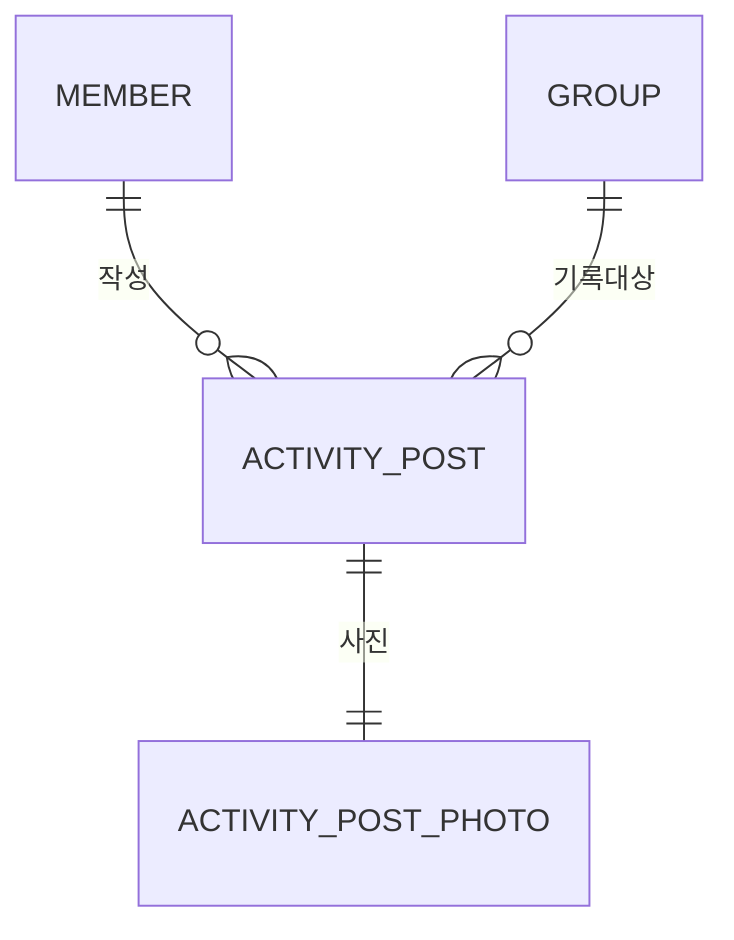

# ActivityPost

그룹 활동을 사진 중심으로 공개하는 게시물이다. 자동 생성되는 도메인 활동 이력이나 분석 이벤트(PostHog)가 아니다.

## 관계와 저장

- `ActivityPost`: 그룹, 작성 회원, 선택 캡션(최대 50자), 활동 날짜, 생성·수정·숨김 시각을 가진다.
- `ActivityPostPhoto`: 게시물과 분리된 사진 키 참조다. v1은 유니크한 게시물 ID로 사진 한 장을 제한한다.
- 활동 날짜는 `LocalDate`이며 기본값은 오늘, 과거 날짜 허용, 미래 날짜 불가다.
- 모든 기록은 전체 공개이며 그룹 이름·유형·상태와 작성자 `crewName`을 반환한다.
- 그룹 삭제 전 게시물의 `group_id`를 비우고 `deleted_at`을 기록해 공개 조회에서 제외한다. 종료된 그룹 기록은 보존한다.

## 권한

- 생성: 로그인한 해당 그룹의 구성원. 그룹은 `ACTIVE` 상태여야 한다.
- 수정·숨김: 작성자 또는 현재 그룹의 `LEADER`.
- 작성자 권한은 그룹 탈퇴 후에도 유지한다.
- `canModify`는 현재 요청자에 대한 표시용 값이며, 서버 권한 검사를 대체하지 않는다.

## 조회·페이지네이션

전체·그룹별 목록은 `activityDate DESC, id DESC`로 조회한다. 커서는 URL-safe Base64로
`activityDate|id`를 인코딩하며 날짜가 같아도 안정적으로 다음 페이지를 이어 간다. `mine=true`는
로그인 회원 본인의 기록만 반환한다.

## 인덱스·제약

- 전체 최신순: `(activity_date DESC, id DESC)`
- 그룹 최신순: `(group_id, activity_date DESC, id DESC)`
- 작성자 기록: `(author_member_id, activity_date DESC, id DESC)`
- 사진 테이블은 `activity_post_id`, `image_key` 각각 유니크다.

수동 마이그레이션은 `backend/db/migrations/2026-09-28-activity-post.sql`에 있다.
