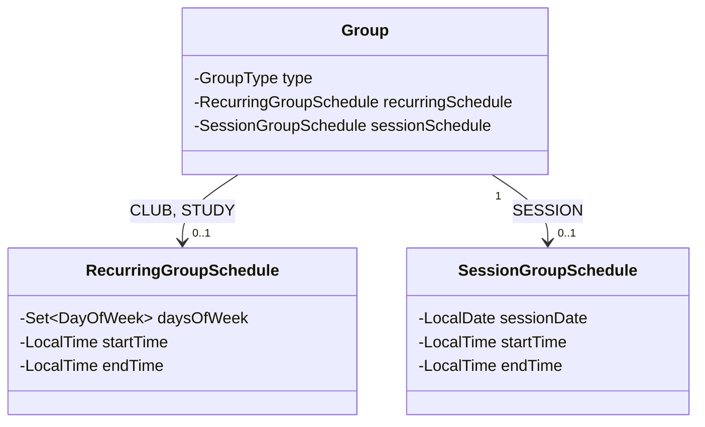

# 일정 모델

## 일정 구조

### RecurringGroupSchedule

`CLUB`, `STUDY`의 고정 주간 일정을 표현한다.

| 필드 | 타입 | 제약 | 설명 |
| --- | --- | --- | --- |
| `daysOfWeek` | `Set<DayOfWeek>` | NOT NULL, 1개 이상 | 매주 활동하는 요일 |
| `startTime` | LocalTime | nullable, `endTime`과 함께 정하거나 함께 비운다 | 활동 시작 시각. 비어 있으면 시간 유동적 |
| `endTime` | LocalTime | nullable, 값이 있으면 `startTime < endTime` | 활동 종료 시각. 비어 있으면 시간 유동적 |

두 시각을 함께 비운 반복 일정은 요일만 고정하고 시간은 매번 따로 정하는 **시간 유동적** 일정이다. 한쪽만 비운 요청은 도메인에서 거절한다. 반복 일정 자체가 없는 **유동적 일정**과는 다르다. 유동적 일정은 요일도 정하지 않은 상태다.

### SessionGroupSchedule

`SESSION`의 일회성 일정을 표현한다.

| 필드 | 타입 | 제약 | 설명 |
| --- | --- | --- | --- |
| `sessionDate` | LocalDate | NOT NULL | 세션 진행 날짜 |
| `startTime` | LocalTime | NOT NULL | 세션 시작 시각 |
| `endTime` | LocalTime | NOT NULL, `startTime < endTime` | 세션 종료 시각 |

### 일정 모델 규칙

- `RecurringGroupSchedule`과 `SessionGroupSchedule` 사이에는 상속 관계를 두지 않는다.
- `SessionGroupSchedule`은 `startTime`과 `endTime`이 모두 필수이며 `startTime < endTime`을 만족해야 한다.
- `RecurringGroupSchedule`의 `startTime`과 `endTime`은 함께 정하거나 함께 비워야 한다. 한쪽만 비운 요청은 거절한다.
- 두 시각을 함께 비운 반복 일정은 요일만 고정하고 시간은 정하지 않은 시간 유동적 일정이다.
- 시각을 정한 반복 일정은 `startTime < endTime`을 만족해야 한다.
- `RecurringGroupSchedule.daysOfWeek`는 시간을 비운 경우에도 하나 이상의 요일을 가져야 한다.
