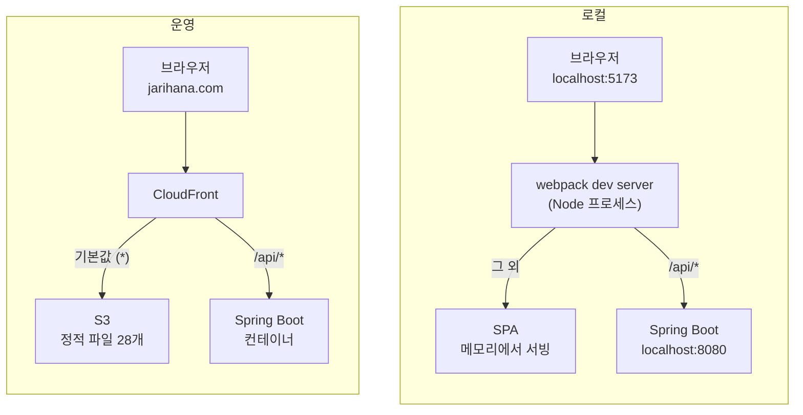

# `/api` 접두사는 누가 떼는가

2026-08-24에 GitHub 로그인이 동작하지 않아 하루 동안 여러 방법을 시도했습니다. 대부분 실패했고
실패한 이유가 전부 같은 뿌리에서 나왔습니다. 이 문서는 그 시도들을 순서대로 놓고 각각이 어디서
막혔는지 정리합니다.

읽고 나면 다음을 알게 됩니다.

- 요청이 브라우저에서 컨트롤러까지 가는 동안 어떤 계층을 지나는지
- 그 계층이 로컬과 운영에서 어떻게 다른지
- 왜 "로컬에서 되니까 됐다"가 위험한 판단인지

결론부터 말하면 백엔드에 `context-path: /api`를 줘서 접두사를 뗄 필요 자체를 없앴습니다. 왜 그쪽을
골랐는지는 6절에 있습니다.

결정 자체는 [ADR 0006](../adr/0006-api-prefix-backend-context-path.md)에, 시도 2의 개발 계정
우회로를 폐지한 결정은 [ADR 0005](../adr/0005-remove-local-development-auth-bypass.md)에 있습니다.
이 문서는 그 결정에 이르기까지의 기록입니다.

---

## 1. 지형부터 그린다

문제를 이해하려면 요청이 지나는 길을 먼저 알아야 합니다. 로컬과 운영은 **계층 구성이 다릅니다.**



여기서 **가장 중요한 사실**은 이것입니다.

> webpack dev server는 로컬에만 있습니다. 운영에는 없습니다.

`devServer` 설정은 `npm run dev`로 Node 프로세스를 띄웠을 때만 동작합니다. 프로덕션 빌드
산출물을 보면 명확합니다.

```
frontend/dist/  ->  index.html, assets/, manifest.webmanifest   정적 파일 28개
```

요청을 받아 다른 곳으로 넘겨줄 서버가 없습니다. 확인해 보면 운영의 SPA는 S3가 직접 내려줍니다.

```
$ curl -sI https://jarihana.com/ | grep -i server
Server: AmazonS3
```

운영에서 webpack 프록시의 자리를 대신하는 것은 **CloudFront**입니다. 이 대응 관계를 기억해 두세요.

| | 로컬 | 운영 |
| --- | --- | --- |
| 경로 보고 목적지 고르는 계층 | webpack dev server | CloudFront |
| SPA 서빙 | webpack dev server | S3 |
| API | Spring Boot | Spring Boot |

---

## 2. 문제의 뿌리

프론트엔드는 API를 `/api/...`로 호출합니다. 어떤 요청이 SPA 라우트이고 어떤 요청이 API인지
구분해야 하기 때문입니다. `/groups`는 화면 주소이고 `/api/groups`는 데이터 요청입니다.

그런데 Spring 컨트롤러는 `/api` 없이 매핑되어 있었습니다.

```java
@RequestMapping("/groups")          // GroupQueryController
@RequestMapping("/oauth/github")    // GithubOAuthCommandController
```

즉 **브라우저가 보내는 경로와 백엔드가 아는 경로가 다릅니다.** 누군가 중간에서 `/api`를 떼야
합니다. 이 문서의 제목이 그 질문입니다.

로컬에서는 webpack 프록시가 그 일을 했습니다.

```js
{ context: ["/api"], pathRewrite: { "^/api": "" }, target: "http://localhost:8080" }
```

**운영에는 그 일을 하는 주체가 없었습니다.** 여기서부터 모든 시도가 갈립니다.

---

## 3. 시도들

### 시도 1. redirect_uri를 백엔드로 직접 보낸다

`.env.example`이 이렇게 안내하고 있었습니다.

```
GITHUB_OAUTH_REDIRECT_URI=http://localhost:8080/api/oauth/github/callback
```

GitHub 인증을 마치면 브라우저가 이 주소로 돌아옵니다. 그런데 화면이 아니라 401 JSON 원문이
뜹니다.

**왜 안 되나.** 이 주소는 포트 8080, 즉 **백엔드로 직행**합니다. 5173의 webpack 프록시를 거치지
않습니다. 프록시가 없으니 `/api`를 떼는 주체도 없고 백엔드는 모르는 경로를 받습니다.

```
$ curl -s http://localhost:8080/oauth/github/callback
{"error":{"code":"OAUTH_INVALID_CALLBACK"}}       400   컨트롤러 도달

$ curl -s http://localhost:8080/api/oauth/github/callback
{"error":{"code":"UNAUTHENTICATED"}}              401   매핑 없음
```

**교훈.** OAuth 콜백은 **브라우저가 직접 이동하는 주소**입니다. XHR이 아니라 top-level
navigation이라 프론트엔드 코드가 무엇을 하든 상관없이 GitHub이 지정한 주소로 갑니다. 그 주소가
프록시를 거치는 주소인지 아닌지를 반드시 따져야 합니다.

### 시도 2. 로컬에서 OAuth 테스트가 안 되니 개발 계정으로 우회한다

`X-Jarihana-Development-Auth` 헤더를 보내면 고정 회원(`member-id: 1`)으로 인증되는 우회로가
있었습니다. 전제는 "로컬에서 OAuth를 제대로 테스트할 수 없다"였습니다.

**왜 안 되나.** 전제가 사실이 아니었습니다. GitHub 토큰 엔드포인트에 물어보면 로컬 주소도
등록되어 있습니다(4절 참고). 그리고 이 우회로는 **정상 로그인을 망가뜨리고 있었습니다.**

같은 가입 세션 쿠키로 `/members/me`를 두 번 호출한 결과입니다.

```
세션 쿠키만            200  {"signupCompleted":false,"member":null}
세션 쿠키 + 개발 헤더  401  UNAUTHENTICATED
```

필터가 존재하지 않는 회원으로 인증시키고 `MemberQueryService.findMyProfile`이 `memberId` 분기를
먼저 타서 정상 가입 세션까지 가려버립니다. GitHub 인증을 정상적으로 마치고 돌아온 사용자가
"로그인을 마치지 못했어요" 화면을 보게 된 원인이 이것이었습니다.

**교훈.** "X가 안 되니 우회로를 만들자"를 결정하기 전에 **X가 정말 안 되는지 측정**해야 합니다.
그리고 우회로가 정상 경로를 가리지 않는지 확인해야 합니다. 여기서는 우회로가 정상 경로를
망가뜨렸고 그 때문에 "로컬 OAuth가 안 된다"는 관찰이 더 굳어졌습니다. 인과가 반대로 돌았습니다.

### 시도 3. 프록시가 `/api`를 자르니 해결됐다

webpack 프록시에 `pathRewrite`를 넣었습니다. 로컬에서 로그인이 됩니다. 실제로 GitHub 콜백이
컨트롤러까지 도달해 가입 세션이 만들어지는 것을 확인했습니다.

**왜 부족한가.** **로컬만 고쳤습니다.** 운영에는 그 프록시가 없습니다.

```
$ curl -s -o /dev/null -w "%{http_code}" https://jarihana.com/api/groups
401

$ curl -s -o /dev/null -w "%{http_code}" https://jarihana.com/api/zzz-nonexistent
401
```

`GET /groups`는 `SecurityConfig`의 `PUBLIC_GET_PATHS`에 있어 인증 없이 200이어야 합니다. 그런데
**존재하지도 않는 경로와 응답이 똑같습니다.** 백엔드가 `/api/groups`를 그대로 받았고 매처가
안 맞아 마지막 `anyRequest().authenticated()`에 걸렸다는 뜻입니다.

```
매처:      "/groups"
도착한 것:  "/api/groups"     안 맞음  ->  401
```

**교훈.** 로컬에서 통과했다는 사실은 운영에서 통과한다는 근거가 되지 못합니다. 두 환경의 계층
구성이 다르기 때문입니다. 로컬이 완결되어 있으면 오히려 운영의 구멍이 안 보입니다. 오늘 이
구멍을 하루 종일 못 본 이유가 그것입니다.

### 시도 4. `target`이 운영인 프록시를 추가한다

"그럼 webpack 프록시에 `target: https://jarihana.com`을 추가하면 되지 않나?"

**왜 안 되나.** 두 가지가 겹칩니다.

첫째, **그 프록시는 운영에 존재하지 않습니다.** 1절에서 본 대로 배포된 프론트엔드는 정적 파일
28개입니다. 설정을 아무리 고쳐도 운영 사용자는 누구의 dev server도 거치지 않습니다. 이건 로컬
개발 서버가 어디를 바라볼지를 정하는 설정이지 운영 동작을 바꾸는 설정이 아닙니다.

둘째, 그렇게 해도 동작하지 않습니다. `/api`를 떼고 `https://jarihana.com/groups`로 보내면
CloudFront의 기본 동작이 그것을 S3의 SPA로 보냅니다.

```
$ curl -s https://jarihana.com/groups | head -c 40
<!doctype html><html lang="ko">...              SPA HTML

$ curl -s https://jarihana.com/api/groups | head -c 40
{"success":false,"data":null,"error":...        백엔드 JSON
```

**교훈.** 설정 파일을 고칠 때는 **그 설정을 누가 언제 읽는지**를 먼저 확인해야 합니다.
`devServer` 블록은 `webpack serve`만 읽습니다. 빌드 산출물에는 흔적조차 없습니다.

### 시도 5. CloudFront Origin Path로 자른다

CloudFront 원본 설정에 Origin Path라는 항목이 있습니다. 이걸로 `/api`를 떼면 되지 않을까요?

**왜 안 되나.** Origin Path는 **붙이는** 기능입니다. 떼는 기능이 아닙니다. 원본에 요청을 보낼 때
지정한 경로를 앞에 덧붙입니다. 방향이 반대입니다.

CloudFront에서 경로를 떼려면 **CloudFront Function**이나 **Lambda@Edge**를 뷰어 요청 단계에
연결해서 URI를 직접 고쳐야 합니다. 동작(behavior) 설정만으로는 불가능합니다.

**교훈.** CloudFront 동작은 **어느 원본으로 보낼지만 정합니다.** 경로는 건드리지 않습니다.
"경로 패턴으로 분기한다"와 "경로를 변형한다"는 다른 일입니다. 이 둘을 같은 것으로 착각하면
"CloudFront가 이미 `/api`를 처리하고 있다"고 잘못 결론 내리게 됩니다.

### 시도 6. 이미지도 `/api` 아래로 옮긴다

백엔드에 `context-path: /api`를 주자 정적 이미지도 딸려 들어갔습니다.

```
8080/images/default-group.png       404
8080/api/images/default-group.png   200
```

그래서 프론트엔드도 `/api/images/...`를 쓰게 하면 되지 않을까요?

**왜 안 되나.** 동작은 합니다. 다만 **잘못된 자리에 못을 박는 것**입니다. `/api`는 백엔드
애플리케이션의 이름공간입니다. JSON을 주고받는 곳이지 PNG를 두는 곳이 아닙니다.

확인해 보니 백엔드가 서빙하는 이미지는 **플레이스홀더 한 장뿐이고 업로드 기능도 없습니다.**

```
backend/src/main/resources/static/images/default-group.png    유일한 파일
MultipartFile 사용처                                          없음
```

백엔드가 UI 자산 한 장을 위해 정적 서버 노릇을 하고 있었습니다. 옳은 해법은 접두사를 붙이는
것이 아니라 **파일을 프론트엔드로 옮기는 것**입니다. 그러면 프론트엔드 코드는 한 줄도 안
바뀝니다.

```
normalizeRepresentativeImageUrl("images/default-group.png")  ->  /images/default-group.png   그대로
```

**교훈.** 증상에 맞춰 경로를 바꾸기 전에 **그 리소스가 왜 거기 있는지** 물어야 합니다. 잘못된
위치에 있는 것을 옮기는 대신 주소만 고치면, 잘못된 구조가 한 겹 더 굳어집니다.

---

## 4. 곁가지: redirect_uri는 세 곳이 같아야 한다

경로 문제와 별개로 오늘 시간을 많이 쓴 지점입니다. GitHub OAuth는 `redirect_uri`를 **두 번**
확인하고 그 값은 **미리 등록**되어 있어야 합니다.

```
1. 프론트엔드가 authorize URL을 만들 때   APP_GITHUB_REDIRECT_URI
2. 백엔드가 인가 코드를 토큰으로 바꿀 때   GITHUB_OAUTH_REDIRECT_URI
3. GitHub 앱에 등록된 Callback URL
```

세 값이 전부 같은 문자열이어야 합니다. 하나라도 다르면 `redirect_uri_mismatch`로 거절됩니다.

등록 여부는 이렇게 확인할 수 있습니다. 아무 의미 없는 인가 코드를 보내면 오류 코드로 갈립니다.

```bash
curl -s -X POST https://github.com/login/oauth/access_token \
  -H "Accept: application/json" \
  --data-urlencode "client_id=$CID" \
  --data-urlencode "client_secret=$CSEC" \
  --data-urlencode "code=deadbeefdeadbeefdead" \
  --data-urlencode "redirect_uri=$URL"
```

| 응답 | 의미 |
| --- | --- |
| `redirect_uri_mismatch` | 등록되지 않은 주소 |
| `bad_verification_code` | redirect_uri 검증 통과. 인가 코드가 가짜라 난 오류 |

`bad_verification_code`가 나오면 그 주소는 **등록되어 있다**는 뜻입니다. 이 방법으로 어느 주소가
등록되어 있는지 추측 없이 확인할 수 있습니다.

참고로 client id가 `Iv23li`로 시작하면 **GitHub App**입니다. GitHub App은 callback URL을 여러 개
등록할 수 있어 운영과 로컬이 공존합니다. `Ov23li`로 시작하는 **OAuth App**은 하나만 등록할 수
있어 사정이 다릅니다.

---

## 5. 관통하는 원리

여섯 개의 시도가 실패한 이유를 압축하면 세 가지입니다.

### 원리 1. 계층은 환경마다 다르게 존재한다

로컬에만 있는 계층(webpack dev server)에 로직을 넣으면 그 로직은 로컬에만 존재합니다. 운영에서
같은 역할을 하는 계층(CloudFront)에도 같은 로직을 넣어야 비로소 완성됩니다.

이것이 시도 3과 시도 4가 막힌 이유입니다.

### 원리 2. 경로 매칭은 "무엇이 도착했는가"로 결정된다

`SecurityConfig`의 매처는 실제로 도착한 경로를 봅니다. 코드에 `/groups`라고 적혀 있어도
`/api/groups`가 도착하면 안 맞습니다.

```
매처 "/groups"  vs  도착 "/groups"      -> permitAll -> 200
매처 "/groups"  vs  도착 "/api/groups"  -> 안 맞음   -> anyRequest().authenticated() -> 401
```

여기서 **매핑이 없을 때 404가 아니라 401이 나온다**는 점이 진단을 어렵게 합니다. Spring
Security가 컨트롤러 탐색보다 먼저 인가 판단을 하기 때문입니다. 401을 보고 "인증 문제"라고
넘겨짚으면 경로 문제를 영영 못 찾습니다.

**진단 요령.** 존재할 리 없는 경로를 같이 찔러 보세요. 응답이 같으면 인증 문제가 아니라
**매핑이 없는 것**입니다.

```
/api/groups            401
/api/zzz-nonexistent   401   <- 같다면 매핑 부재
```

### 원리 3. 자르는 대신 자를 필요를 없앨 수 있다

`context-path: /api`를 주면 Spring이 매칭 전에 컨텍스트 경로를 스스로 떼어냅니다. 매처는 그대로
`/groups`를 봅니다. 그래서 `SecurityConfig`를 한 줄도 고치지 않아도 됩니다.

```
context-path 없음 + 프록시가 자름   ->  매처가 보는 경로: /groups   (자르는 주체 필요)
context-path /api                  ->  매처가 보는 경로: /groups   (Spring이 처리)
```

결과는 같지만 **자르는 주체가 환경마다 필요하냐**가 다릅니다.

---

## 6. 무엇을 골랐나

정리하면 방법은 두 가지뿐이었습니다.

| | 자르는 위치 | 필요한 작업 | 규칙이 사는 곳 |
| --- | --- | --- | --- |
| A. 엣지에서 자른다 | webpack 프록시 + CloudFront | CloudFront Function 신규 작성 | 두 곳 |
| B. 자를 필요를 없앤다 | 없음 | `context-path: /api` 한 줄 | 없음 |

원칙만 놓고 보면 둘 다 정당합니다.

- **A의 논리**: 앱은 자기가 어떻게 배포되는지 몰라야 한다. 접두사는 배포 토폴로지의 사실이고
  인프라가 안다
- **B의 논리**: 접두사는 계약이다. 계약은 한 곳에만 있어야 한다

**B를 골랐습니다.** 원칙 대결로 고른 것이 아니라 파편화 때문에 골랐습니다.

### 왜 B인가

**첫째, A는 같은 규칙을 코드와 인프라에 나눠 심습니다.** webpack 설정에 한 벌, CloudFront
Function에 한 벌입니다. 두 벌이 어긋나면 무슨 일이 벌어지는지는 이 문서 전체가 보여준 그대로입니다.
로컬은 멀쩡한데 운영만 401이 났고, 그 사실을 하루 종일 파악하지 못했습니다. 환경이 갈리는 지점을 하나
더 만드는 선택지를, 환경이 갈려서 하루를 태운 직후에 고르기는 어려웠습니다.

**둘째, 프론트엔드가 환경을 몰라도 됩니다.** `/api`가 로컬에서도 운영에서도 같은 문자열이 되니
"지금 개발 모드인가"를 묻는 분기가 필요 없습니다. 그 자리는 하드코딩 한 줄이 대신합니다.

```js
baseUrl = "/api/"        // frontend/src/shared/api/client.js
```

로컬 실행을 위해 프론트엔드에 분기를 심는 습관은 이미 한 번 대가를 치렀습니다. 시도 2의 개발
계정 우회로가 그것이었고, 정상 로그인을 가려버렸습니다. 같은 종류의 분기를 API 주소에서도
없앨 수 있다면 없애는 쪽이 낫습니다.

**셋째, 비용은 알고 골랐습니다.** B는 **백엔드가 `/api` 밖 경로를 받을 수 없게 만듭니다.** 외부가
경로를 정해주는 웹훅이나 헬스체크(`/actuator/health`)가 생기면 걸립니다. 지금 이 프로젝트에는
actuator도 swagger도 없어 해당 사항이 없지만, 나중에 생기면 그때 비용을 냅니다. 공짜라서 고른
것이 아니라, 미룰 수 있는 비용과 이미 치른 비용을 견준 결과입니다.

### 적용 결과

```
application.yaml           context-path: /api 추가
webpack.config.mjs         프록시의 pathRewrite 제거. 이제 있는 그대로 전달한다
SecurityConfig             무수정. 매처는 context-path 기준 상대 경로라 "/groups" 그대로
```

테스트 설정에도 같은 `context-path`를 주고 `RestAssured.basePath`를 맞췄습니다. 그전에는 테스트
설정이 main 설정을 통째로 가려서 경로 구조가 아예 검증되지 않았습니다. 오늘의 구멍이 테스트를
통과하고도 살아남은 이유가 여기에도 있습니다.

---

## 7. 다음에 비슷한 걸 만나면

체크리스트로 남깁니다.

1. **경로를 그려라.** 브라우저에서 컨트롤러까지 어떤 계층을 지나는지 로컬과 운영을 나란히 적는다
2. **양쪽 다 측정하라.** 로컬에서 됐다고 끝내지 말 것. 운영에도 같은 요청을 보내 본다
3. **존재하지 않는 경로를 대조군으로 써라.** 401이 인증 문제인지 매핑 부재인지 확인할 수 있다.
4. **설정을 누가 읽는지 확인하라.** `devServer`는 개발 서버만, `application.yaml`은 애플리케이션만
5. **우회로를 만들기 전에 전제를 측정하라.** "안 된다"가 사실인지 확인한다
6. **주소를 고치기 전에 리소스의 자리를 물어라.** 잘못된 위치를 주소로 덮지 않는다
7. **테스트 설정이 무엇을 가리는지 보라.** 테스트가 main 설정을 통째로 덮어쓰면 그 설정은 아무도
   검증하지 않는다
8. **선택지를 고를 때 환경이 갈리는 지점을 세라.** 규칙이 사는 곳이 하나면 어긋날 수 없다
