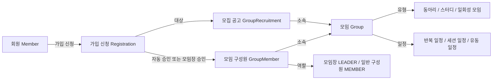

# 자리하나 비즈니스 용어 사전

> 문서 상태: 초안 — 팀 합의 후 확정 필요
> 검토 기준일: 2026-08-27
> 코드 기준: 로컬 작업 트리 `6b1509d` 및 로컬에 존재하는 전체 Git 이력
> 대상 독자: 사용자, 기획자, 디자이너, 개발자
> 목적: 같은 개념은 같은 이름으로, 다른 개념은 다른 이름으로 표현한다.

## 문서 사용 원칙

- **비즈니스 표준어**는 화면 문구, 기획, 정책, 회의에서 우선 사용한다.
- **영문명 또는 코드명**은 비즈니스 표준어를 구현 요소와 연결하는 대응표이지, 사용자 화면의 권장 문구가 아니다.
- 상태가 **확정**인 항목은 설계 문서와 현재 구현의 의미가 일치하는 개념이다.
- 상태가 **제안**인 항목은 개념 자체는 확인되지만 표준 명칭에 팀 합의가 필요하다.
- 상태가 **확인 필요**인 항목은 자료끼리 의미가 충돌하거나 정책 근거가 부족하다.
- 이 문서에서 “모임”은 사용자·비즈니스 언어, `Group`은 같은 개념의 코드·데이터 언어로 제안한다. 팀이 다른 기준을 선택하기 전까지 코드의 일괄 개명은 하지 않는다.

## 용어 사전 원본·검토·게시 운영 정책

이 절은 자리하나 서비스의 도메인 용어가 아니라, 이 용어 사전을 관리하고 공개하는 방법을 정의한다. 아래 내용은 팀 운영 제안이며, 팀 합의 후 확정한다.

| 구분      | 운영 기준                                                                                                                                          |
| --------- | -------------------------------------------------------------------------------------------------------------------------------------------------- |
| 정본      | `docs/자리하나_비즈니스_용어_사전.md`를 용어 사전의 유일한 정본으로 한다. 용어 정의와 정책 문구는 이 파일에서만 수정한다.                          |
| 검토 기록 | 정본의 수정은 브랜치와 Pull Request(PR)로 제안한다. 팀원은 PR의 `Files changed`에서 줄 단위 댓글·수정 제안을 남기고, 전체 의견은 PR 대화에 남긴다. |
| 게시본    | GitHub Wiki는 비개발자가 읽는 최종 게시본으로 사용한다. Wiki의 내용은 정본을 반영한 결과이며 별도의 원본으로 취급하지 않는다.                      |
| 갱신 시점 | 정본 PR이 Merge되면 담당자가 Wiki 게시본을 갱신한다. 자동화가 도입되기 전에는 수동 갱신으로 운영한다.                                              |
| 출처 표시 | Wiki 페이지 하단에 정본 파일 링크와 해당 게시를 만든 PR 링크를 표시한다.                                                                           |

### 세부 규칙

1. **Wiki는 읽는 곳으로 사용한다.** 비개발자와 일반 구성원은 Wiki에서 최신 용어 사전을 읽는다.
2. **수정은 정본 파일의 PR에서만 진행한다.** 문구, 정의, 상태, 근거를 바꾸려면 정본 파일을 수정하는 PR을 만든다.
3. **Wiki를 직접 수정하지 않는다.** 긴급한 오탈자 수정이 필요해도 먼저 정본 PR을 반영한 뒤 Wiki를 갱신한다.
4. **PR이 Merge되면 Wiki를 갱신한다.** 게시 담당자는 Merge된 정본의 내용을 Wiki에 반영하고, 반영 여부를 PR에 기록한다.
5. **Wiki 하단에 출처를 표시한다.** 최소한 정본 문서 링크, 마지막 반영일, 원본 PR 링크를 함께 표시한다.

> 이 정책을 적용하면 정본과 Wiki에 내용이 모두 보일 수 있지만, 수정 가능한 자료의 원천은 정본 하나로 유지된다. PR의 댓글·수정 제안·승인 기록은 GitHub에 남고, Wiki는 그 결과를 읽기 쉽게 제공하는 게시 채널이다.

## 검토 범위와 근거 우선순위

다음 자료를 교차 검토했다.

1. 채택된 도메인·정책 문서: `backend/docs/context/domain/*`
2. API 설계 문서: `backend/docs/context/api/*`
3. 백엔드 엔티티, 값 객체, 서비스, Controller, DTO, Repository와 테스트: `backend/src/*`
4. 프론트엔드 화면 문구, 사용자 흐름, 스키마와 API 호출: `frontend/src/*`, `frontend/docs/IMPLEMENTATION_MAP.md`, `frontend/DESIGN.md`
5. 데이터 예시와 매핑: JPA 엔티티 및 `backend/.local/seed.sql`
6. README, ADR, 커밋 본문과 병합 PR 번호를 포함한 Git 이력

GitHub 이슈·PR의 원격 본문 전체는 로컬 저장소에 포함되어 있지 않아, 로컬 Git에 남은 병합 PR 번호·제목·커밋 본문까지만 근거로 사용했다. 따라서 원격 논의에서만 합의된 내용이 있다면 추가 확인이 필요하다.

## 핵심 관계

핵심 구분은 다음과 같다.

| 구분        | 무엇을 뜻하는가                                             | 독립 데이터인가        | 권장 사용                                   |
| ----------- | ----------------------------------------------------------- | ---------------------- | ------------------------------------------- |
| 자리        | 서비스의 브랜드·탐색 표현. 현재 여러 의미로 쓰임            | 아니요                 | 의미를 수식해 사용하거나 브랜드 문구로 제한 |
| 모임        | 동아리·스터디·일회성 모임을 포괄하는 활동 자체              | 예, `Group`            | 사용자·기획 표준어로 제안                   |
| 모집 공고   | 한 모임이 특정 기간과 정원으로 사람을 모집하는 한 번의 공고 | 예, `GroupRecruitment` | “모임”과 분리                               |
| 가입 신청   | 회원이 특정 모집 공고에 제출한 요청과 그 처리 이력          | 예, `Registration`     | “가입” 또는 “참여”와 분리                   |
| 모임 구성원 | 실제로 모임에 속한 회원과 모임의 관계                       | 예, `GroupMember`      | 승인된 신청과 분리                          |

# 1. 용어 목록 요약

| 표준 용어        | 영문명                      | 한 줄 정의                                                                  | 상태      | 혼용 가능성이 있는 용어                           |
| ---------------- | --------------------------- | --------------------------------------------------------------------------- | --------- | ------------------------------------------------- |
| 자리             | Seat                        | 모임이나 모집 기회를 친근하게 표현하는 자리하나의 브랜드 언어               | 확인 필요 | 모임, 그룹, 모집, 남은 자리                       |
| 모임             | Group                       | 동아리·스터디·일회성 모임을 포괄하며 모집과 무관하게 존속하는 활동 단위     | 제안      | 그룹, 자리, 활동                                  |
| 모임 유형        | Group Type                  | 모임의 목적·지속 형태를 동아리, 스터디, 일회성 모임으로 분류한 값           | 확정      | 그룹 유형, 모임 종류, 세션                        |
| 모임 진행 방식   | Meeting Type                | 모임을 온라인·오프라인·온오프라인 유동 중 어떻게 진행하는지 나타내는 값     | 확정      | 모임 방식, 유형, 유동적                           |
| 활동 일정        | Activity Schedule           | 모임이 언제 활동하는지를 포괄하는 상위 비즈니스 표현                        | 제안      | 모임 일정, 정기 일정, 스케줄                      |
| 반복 일정        | Recurring Group Schedule    | 동아리·스터디에 매주 같은 요일과 시간을 적용하는 선택 일정                  | 확정      | 정기 일정, 활동 일정                              |
| 세션 일정        | Session Group Schedule      | 일회성 모임의 한 날짜와 시작·종료 시간을 나타내는 필수 일정                 | 확정      | 단일 일정, 단회 일정, 가입 세션                   |
| 유동 일정        | Flexible Schedule           | 동아리·스터디의 고정 요일과 시간이 정해지지 않은 상태                       | 확정      | 일정 협의, 유동적, FLEXIBLE                       |
| 회원             | Member                      | 자리하나 서비스 가입을 완료한 사용자                                        | 확정      | 사용자, 크루, 멤버                                |
| 크루             | Crew                        | 우아한테크코스 참여자를 친근하게 부르는 사용자 관점의 호칭                  | 제안      | 회원, 멤버, 탐색 크루, 운영 크루                  |
| 모임 구성원      | Group Member                | 회원과 모임 사이에 실제 소속이 성립한 관계                                  | 확정      | 멤버, 모임원, 가입자, 회원                        |
| 모임장           | Group Leader                | 현재 모임을 운영하고 보호된 변경을 수행하는 유일한 구성원                   | 확정      | 리더, 운영자, 소유자, 방장                        |
| 모임 가입        | Group Membership Activation | 회원에게 모임 구성원 관계가 생성되어 실제 소속이 성립하는 것                | 제안      | 참여, 승인, 가입 완료                             |
| 모임 이탈        | Group Leave                 | 모임 구성원 관계를 물리 삭제하여 소속을 끝내는 것                           | 확정      | 탈퇴, 멤버 삭제, 강퇴                             |
| 모집 공고        | Group Recruitment           | 한 모임이 정해진 방식·정원·기간으로 사람을 모집하는 한 번의 단위            | 확정      | 모집, 현재 모집, 자리                             |
| 미마감 모집 공고 | Unclosed Recruitment        | 종료 시각이 없거나 현재보다 뒤여서 아직 마감되지 않은 모집 공고             | 제안      | 활성 모집, 현재 모집, 모집 중                     |
| 모집 방식        | Join Method                 | 신청을 즉시 승인할지 모임장이 심사할지를 정하는 공고의 정책                 | 확정      | 가입 방식, 자동 가입, 승인 가입                   |
| 모집 정원        | Recruitment Capacity        | 특정 모집 공고에서 승인할 수 있는 최대 인원                                 | 확정      | 모집 인원, 그룹 정원, 남은 자리                   |
| 모집 단계        | Recruitment Phase           | 모집 기간과 현재 시각으로 계산하는 모집 예정·모집 중·상시 모집·마감 상태    | 제안      | 모집 상태, `UPCOMING`, `SCHEDULED`                |
| 가입 신청        | Registration                | 회원이 특정 모집 공고에 제출한 가입 요청과 그 결정 이력                     | 확정      | 신청, 지원, 참여 신청, 가입                       |
| 신청 상태        | Registration Status         | 가입 신청의 대기·승인·거절 처리 결과                                        | 확정      | 검토 중, 승인 대기, 신청 완료                     |
| 신청 철회        | Registration Withdrawal     | 신청자가 결정 전 가입 신청을 물리 삭제하는 행위                             | 확정      | 신청 취소, `CANCELED`, 삭제                       |
| 신청 결정 주체   | Decision Actor              | 가입 신청의 승인·거절 결과를 만든 회원 또는 시스템                          | 확정      | 처리자, 승인자, 운영자                            |
| 거절 사유        | Rejection Reason            | 거절된 신청에 선택적으로 남기는 설명                                        | 제안      | 결정 사유, 안내, `rejectReason`, `decisionReason` |
| 모임 상태        | Group Status                | 모임의 활동 중·종료 생명주기를 나타내는 값                                  | 확정      | 모집 상태, 활성 상태, 아카이브 상태               |
| 모임 삭제        | Group Deletion              | 생성 후 24시간 이내 활동 중 모임과 모든 연관 데이터를 물리 삭제하는 명령    | 확정      | 종료, 폐쇄, 취소                                  |
| 모임 종료        | Group Termination           | 생성 후 24시간이 지난 활동 중 모임을 되돌릴 수 없는 종료 상태로 바꾸는 명령 | 확정      | 삭제, 아카이빙, 모집 마감                         |
| 모집 마감        | Recruitment Closure         | 모집 공고의 종료 시각을 기준으로 더 이상 신청을 받지 않는 상태 또는 그 전환 | 확정      | 모임 종료, 모집 종료, 정원 마감                   |
| 모임장 위임      | Leadership Transfer         | 현재 모임장과 후임 구성원의 역할을 원자적으로 맞바꾸는 행위                 | 확정      | 리더 이전, 권한 이전, 모임장 넘기기               |

# 2. 상세 용어 사전

## 2.1 자리

- **표준 용어:** 자리
- **영문명 또는 코드명:** `Seat` 제안, 대응 엔티티 없음
- **한 줄 정의:** 모임이나 참여 기회를 친근하게 표현하는 자리하나의 브랜드 언어다.
- **상세 정의:** 현재 화면에서 “자리 둘러보기”는 모임 목록, “자리 만들기”는 모임 개설, “자리 확인”과 “남은 자리”는 모집 공고 및 잔여 정원을 가리킨다. 따라서 하나의 데이터 개념으로 정의할 수 없으며, 브랜드 카피 또는 문맥이 붙은 표현으로만 안전하게 사용할 수 있다.
- **포함되는 범위:** 서비스명과 탐색 카피, `남은 자리`처럼 뜻이 명확한 수식 표현.
- **포함되지 않는 범위:** `Group`, `GroupRecruitment`, `Registration`, `remainingSeats` 중 어느 하나의 정식 동의어.
- **사용 예시:** “함께할 자리를 찾아보세요”, “남은 자리 3자리”.
- **유사하거나 혼용되는 용어:** 모임, 그룹, 모집 공고, 모집 기회, 남은 자리.
- **권장 표현:** 브랜드 문구에는 “자리”, 기능·정책 문장에는 “모임”, “모집 공고”, “남은 자리”처럼 대상을 명시한다.
- **사용하지 않을 표현:** 변수·테이블·API 리소스 이름으로 의미가 정해지지 않은 `seat`; “자리 삭제”처럼 대상이 불명확한 명령.
- **관련 용어:** 모임, 모집 공고, 모집 정원, 남은 자리.
- **근거 자료 또는 발견 위치:** `frontend/src/pages/groups/GroupsPage.jsx`, `frontend/src/pages/groups/GroupDetailPage.jsx`, `frontend/src/pages/manage/ManageRecruitmentsPage.jsx`, `frontend/DESIGN.md`, 커밋 `f0b2f47`, `5c72e3b`.
- **확정 상태:** 확인 필요

## 2.2 모임

- **표준 용어:** 모임
- **영문명 또는 코드명:** `Group`, 테이블 `groups`, API `/api/groups`
- **한 줄 정의:** 동아리·스터디·일회성 모임을 포괄하며 모집 여부와 무관하게 존속하는 활동 단위다.
- **상세 정의:** 모임은 이름, 유형, 진행 방식, 장소, 소개, 일정, 활동 상태를 가진다. 하나의 모임은 시기별로 여러 모집 공고를 만들 수 있고 모집이 끝나도 계속 존재한다. 전체 인원 제한은 모임이 아니라 각 모집 공고가 가진다. 현재 코드·API에서는 `Group`, 화면에서는 주로 “모임”이라고 부른다.
- **포함되는 범위:** `CLUB`, `STUDY`, `SESSION` 유형의 활동 자체와 그 생명주기.
- **포함되지 않는 범위:** 특정 회차의 모집 공고, 가입 신청, 물리적 좌석, 단순 채팅방.
- **사용 예시:** “모임을 개설한다”, “이 모임은 현재 활동 중이다”, “이 모임에는 모집 공고가 3개 있다.”
- **유사하거나 혼용되는 용어:** 그룹, 자리, 활동, 동아리, 스터디, 세션.
- **권장 표현:** 사용자 화면·기획·정책에는 “모임”; 코드·DB·API에는 기존 `Group`을 유지하고 문서에서 대응 관계를 명시한다.
- **사용하지 않을 표현:** 같은 문서에서 설명 없이 “그룹”과 “모임”을 번갈아 사용; 모집 공고를 “모임”이라고 부르는 표현.
- **관련 용어:** 모임 유형, 모임 상태, 모집 공고, 모임 구성원.
- **근거 자료 또는 발견 위치:** `backend/docs/context/domain/model.md`의 `Group`, `backend/src/main/java/com/project/jarihana/group/domain/Group.java`, `frontend/src/pages/groups/*`, `frontend/README.md`, 커밋 `9e21e66`, `af15de8`.
- **확정 상태:** 제안

## 2.3 모임 유형

- **표준 용어:** 모임 유형
- **영문명 또는 코드명:** `GroupType`
- **한 줄 정의:** 모임의 목적과 지속 형태를 분류하는 값이다.
- **상세 정의:** `CLUB`은 친목·취미 중심 동아리, `STUDY`는 학습 중심 스터디, `SESSION`은 한 번 진행하는 일회성 모임이다. 유형은 진행 방식(`MeetingType`)과 별개의 축이며 현재 모임 수정 API에서는 바꿀 수 없다.
- **포함되는 범위:** 동아리(`CLUB`), 스터디(`STUDY`), 일회성 모임/세션(`SESSION`).
- **포함되지 않는 범위:** 온라인·오프라인 여부, 모집 방식, 활동 상태.
- **사용 예시:** “모임 유형은 스터디이고 진행 방식은 온라인이다.”
- **유사하거나 혼용되는 용어:** 그룹 유형, 모임 종류, 모임 방식.
- **권장 표현:** 화면과 기획에서는 “모임 유형”; 값은 “동아리”, “스터디”, “일회성 모임(세션)”.
- **사용하지 않을 표현:** 온라인을 모임 유형으로 표현; 인증 문맥과 구분 없이 `세션`만 단독 사용.
- **관련 용어:** 모임, 모임 진행 방식, 반복 일정, 세션 일정.
- **근거 자료 또는 발견 위치:** `backend/docs/context/domain/model.md`의 `GroupType`, `backend/src/main/java/com/project/jarihana/group/domain/GroupType.java`, `frontend/src/pages/groups/pageUtils.js`.
- **확정 상태:** 확정

| 하위 표준 용어    | 코드      | 정의                             | 일정 규칙                        |
| ----------------- | --------- | -------------------------------- | -------------------------------- |
| 동아리            | `CLUB`    | 친목·취미 중심으로 지속하는 모임 | 반복 일정 선택; 없으면 유동 일정 |
| 스터디            | `STUDY`   | 학습 중심으로 지속하는 모임      | 반복 일정 선택; 없으면 유동 일정 |
| 일회성 모임(세션) | `SESSION` | 한 번 진행하는 모임              | 세션 일정 필수                   |

## 2.4 모임 진행 방식

- **표준 용어:** 모임 진행 방식
- **영문명 또는 코드명:** `MeetingType` — `ONLINE`, `OFFLINE`, `FLEXIBLE`
- **한 줄 정의:** 모임이 온라인·오프라인 중 어떤 방식으로 진행되는지를 나타내는 값이다.
- **상세 정의:** `ONLINE`은 온라인 진행, `OFFLINE`은 오프라인 진행, `FLEXIBLE`은 온라인·오프라인을 고정하지 않고 그때그때 정하는 방식이다. `location`에는 오프라인 장소뿐 아니라 온라인 접속 정보도 저장할 수 있다.
- **포함되는 범위:** 온라인, 오프라인, 온·오프라인 유동.
- **포함되지 않는 범위:** 모임 유형, 활동 요일·시간, 장소 자체.
- **사용 예시:** “진행 방식: 온라인”, “접속 정보: Zoom”.
- **유사하거나 혼용되는 용어:** 모임 방식, 모임 유형, 진행 형태, 유동적.
- **권장 표현:** 필드명은 “모임 진행 방식”; `FLEXIBLE` 표시는 “온·오프라인 유동” 또는 “진행 방식 협의”.
- **사용하지 않을 표현:** `FLEXIBLE`을 단순히 “유동적”이라고만 표시하여 유동 일정과 구분하지 않는 표현.
- **관련 용어:** 모임 유형, 장소, 유동 일정.
- **근거 자료 또는 발견 위치:** `backend/docs/context/domain/model.md`의 `MeetingType`, `backend/src/main/java/com/project/jarihana/group/domain/MeetingType.java`, `frontend/src/pages/group-editor/GroupManagePage.jsx`, `frontend/src/pages/groups/pageUtils.js`.
- **확정 상태:** 확정

## 2.5 활동 일정

- **표준 용어:** 활동 일정
- **영문명 또는 코드명:** `ActivitySchedule` 제안, 공통 도메인 부모 타입 없음
- **한 줄 정의:** 모임이 언제 활동하는지를 사용자 관점에서 포괄하는 상위 표현이다.
- **상세 정의:** 화면에서 반복 일정, 세션 일정, 유동 일정을 한 자리에서 설명할 때 사용하는 비즈니스 용어다. 구현에서는 `RecurringGroupSchedule`과 `SessionGroupSchedule`을 독립된 값 객체로 유지하며 공통 상속 구조를 만들지 않는다.
- **포함되는 범위:** 반복 일정, 세션 일정, 고정 일정이 없는 유동 일정의 화면상 묶음.
- **포함되지 않는 범위:** 모집 기간, 공통 `GroupSchedule` 엔티티 또는 부모 클래스.
- **사용 예시:** “활동 일정을 변경한다”, “활동 일정: 매주 월·수 19:00–21:00”.
- **유사하거나 혼용되는 용어:** 모임 일정, 정기 일정, 스케줄, 모집 일정.
- **권장 표현:** UI 섹션명은 “활동 일정”; 구체 정책과 API에서는 “반복 일정” 또는 “세션 일정”.
- **사용하지 않을 표현:** 모집 시작·마감 기간을 “활동 일정”이라고 부르는 표현.
- **관련 용어:** 반복 일정, 세션 일정, 유동 일정, 모집 기간.
- **근거 자료 또는 발견 위치:** `backend/docs/context/domain/model.md`의 일정 구조, `frontend/src/pages/group-editor/ScheduleDialog.jsx`, 커밋 `4250c5a`.
- **확정 상태:** 제안

## 2.6 반복 일정

- **표준 용어:** 반복 일정
- **영문명 또는 코드명:** `RecurringGroupSchedule`, API `recurringSchedule`
- **한 줄 정의:** 동아리·스터디에 매주 같은 활동 요일과 시작·종료 시간을 적용하는 선택 일정이다.
- **상세 정의:** 하나 이상의 요일과 하나의 공통 시작·종료 시간을 가진다. 동아리와 스터디에만 존재할 수 있고, 없으면 유동 일정이다. 그룹 삭제 시 함께 삭제되며 반복 일정만 제거할 때 모임 자체는 유지된다.
- **포함되는 범위:** 요일 집합, 시작 시각, 종료 시각.
- **포함되지 않는 범위:** 일회성 날짜, 모집 기간, 온라인·오프라인 진행 방식.
- **사용 예시:** “매주 화·목 19:30–21:30”.
- **유사하거나 혼용되는 용어:** 정기 일정, 주간 일정, 활동 일정.
- **권장 표현:** 정책·API·코드 설명에서는 “반복 일정”.
- **사용하지 않을 표현:** “정기 일정”과 “반복 일정”을 별개 개념처럼 사용.
- **관련 용어:** 활동 요일, 유동 일정, 동아리, 스터디.
- **근거 자료 또는 발견 위치:** `backend/src/main/java/com/project/jarihana/group/domain/RecurringGroupSchedule.java`, `ActivityDays.java`, `/api/groups/{groupId}/recurring-schedule`, 커밋 `76bbbe2`, `eaac3b3`.
- **확정 상태:** 확정

## 2.7 세션 일정

- **표준 용어:** 세션 일정
- **영문명 또는 코드명:** `SessionGroupSchedule`, API `sessionSchedule`
- **한 줄 정의:** 일회성 모임의 한 날짜와 시작·종료 시간을 나타내는 필수 일정이다.
- **상세 정의:** `SESSION` 유형의 모임은 정확히 하나의 세션 일정을 가져야 한다. 반복 일정과 동시에 존재할 수 없으며, 필수 값이므로 별도 삭제 API는 제공하지 않고 교체만 허용한다.
- **포함되는 범위:** 진행 날짜, 시작 시각, 종료 시각.
- **포함되지 않는 범위:** 가입 세션, OAuth 세션, 반복 요일, 모집 기간.
- **사용 예시:** “2026-09-01 13:00–15:00”.
- **유사하거나 혼용되는 용어:** 단회 일정, 단일 일정, 일회성 일정, 세션.
- **권장 표현:** 인증 문맥과 섞일 수 있는 문서에서는 “일회성 모임의 세션 일정”이라고 처음 한 번 풀어 쓴다.
- **사용하지 않을 표현:** “세션”만으로 모임 유형, 일정, 인증 세션을 모두 지칭.
- **관련 용어:** 일회성 모임, 활동 일정, 가입 세션.
- **근거 자료 또는 발견 위치:** `backend/src/main/java/com/project/jarihana/group/domain/SessionGroupSchedule.java`, `/api/groups/{groupId}/session-schedule`, 커밋 `48e9e81`.
- **확정 상태:** 확정

## 2.8 유동 일정

- **표준 용어:** 유동 일정
- **영문명 또는 코드명:** `Flexible Schedule`; 코드에서는 `recurringSchedule = null`
- **한 줄 정의:** 동아리·스터디의 고정 활동 요일과 시간이 정해지지 않은 상태다.
- **상세 정의:** 별도 상태 enum이나 일정 엔티티가 아니라 반복 일정 값이 없는 상태다. `MeetingType.FLEXIBLE`과는 독립적이므로 진행 방식은 고정되어 있으나 일정만 유동일 수도 있고, 그 반대도 가능하다.
- **포함되는 범위:** `CLUB`, `STUDY`에서 `recurringSchedule`이 없는 경우.
- **포함되지 않는 범위:** `SESSION`, 온라인·오프라인 방식이 유동적인 상태.
- **사용 예시:** “활동 일정: 일정 협의”.
- **유사하거나 혼용되는 용어:** 일정 협의, 유동적, 정기 일정 없음, `MeetingType.FLEXIBLE`.
- **권장 표현:** UI에는 “일정 협의” 또는 “유동 일정”; 데이터 계약에서는 `recurringSchedule: null`.
- **사용하지 않을 표현:** 진행 방식과 일정 모두를 구분 없이 “유동적”으로 표시.
- **관련 용어:** 반복 일정, 모임 진행 방식.
- **근거 자료 또는 발견 위치:** `backend/docs/context/domain/business-policies.md`, `Group.java`, `frontend/src/pages/groups/pageUtils.js`, 커밋 `4a69486`, `fbcd5e7`.
- **확정 상태:** 확정

## 2.9 회원

- **표준 용어:** 회원
- **영문명 또는 코드명:** `Member`
- **한 줄 정의:** GitHub 인증 후 크루명·기수·과정을 입력해 자리하나 가입을 완료한 사용자다.
- **상세 정의:** GitHub 인증만 끝낸 사용자는 아직 회원이 아니다. `Member`는 크루명, 기수, GitHub 숫자 ID, 과정과 서비스 가입 시각을 가진다. 현재 한 회원은 여러 모임에서 탐색자와 운영자 역할을 동시에 가질 수 있다.
- **포함되는 범위:** 가입 완료 사용자와 회원 프로필.
- **포함되지 않는 범위:** 가입 세션만 있는 미가입 사용자, 특정 모임의 소속·역할.
- **사용 예시:** “회원이 모집 공고에 가입 신청한다.”
- **유사하거나 혼용되는 용어:** 사용자, 크루, 멤버, 신청자.
- **권장 표현:** 서비스 계정·인증·프로필 문맥에는 “회원”.
- **사용하지 않을 표현:** `Member`를 언제나 “모임 멤버”로 번역; 가입 전 사용자를 회원으로 단정.
- **관련 용어:** 크루, 모임 구성원, 서비스 가입, 가입 세션.
- **근거 자료 또는 발견 위치:** `backend/src/main/java/com/project/jarihana/member/domain/Member.java`, `POST /api/members`, `GET /api/members/me`, `frontend/src/pages/account/SignupPage.jsx`.
- **확정 상태:** 확정

## 2.10 크루

- **표준 용어:** 크루
- **영문명 또는 코드명:** `Crew`; 속성 `crewName`
- **한 줄 정의:** 우아한테크코스 참여자를 사용자 친화적으로 부르는 호칭이다.
- **상세 정의:** 현재 데이터 모델에 `Crew` 엔티티는 없고 `Member.crewName`만 있다. “탐색 크루”와 “운영 크루”는 고정된 계정 역할이 아니라 특정 시점·모임에서의 사용자 행태를 설명하는 액터다.
- **포함되는 범위:** 크루명, 우테코 기수·과정 맥락, 서비스 카피.
- **포함되지 않는 범위:** 회원 엔티티의 대체 이름, 모임 구성원 관계, 권한 역할.
- **사용 예시:** “8기 백엔드 크루”, “함께할 크루를 찾는다.”
- **유사하거나 혼용되는 용어:** 회원, 멤버, 사용자, 탐색 크루, 운영 크루.
- **권장 표현:** 친근한 화면 호칭에는 “크루”; 정책 주어에는 “회원”; 관계에는 “모임 구성원”.
- **사용하지 않을 표현:** `Crew`를 새 엔티티처럼 설명; “운영 크루”를 `LEADER`와 항상 같은 저장 상태로 단정.
- **관련 용어:** 회원, 모임 구성원, 모임장.
- **근거 자료 또는 발견 위치:** `backend/docs/context/domain/model.md`의 도메인 액터와 `Member`, `frontend/src/pages/groups/GroupsPage.jsx`, `frontend/src/pages/manage/ManageMembersPage.jsx`.
- **확정 상태:** 제안

## 2.11 모임 구성원

- **표준 용어:** 모임 구성원
- **영문명 또는 코드명:** `GroupMember`, 테이블 `group_member`
- **한 줄 정의:** 회원과 모임 사이에 실제 소속이 성립했음을 나타내는 관계다.
- **상세 정의:** 모임 구성원은 모임, 회원, 역할과 모임 가입 시각을 가진다. 모임 개설자는 즉시 모임장 구성원이 되고, 자동 승인 신청 또는 모임장 승인 신청의 결과로 일반 구성원이 생성된다. 신청 이력과는 별도 데이터다.
- **포함되는 범위:** 현재 모임에 속한 `LEADER`와 `MEMBER` 역할의 회원.
- **포함되지 않는 범위:** 대기·거절 신청자, 단순 조회자, 서비스 회원 전체.
- **사용 예시:** “승인되면 모임 구성원이 된다.”
- **유사하거나 혼용되는 용어:** 멤버, 모임원, 가입자, 회원, 참여자.
- **권장 표현:** 정책·데이터에는 “모임 구성원”; 짧은 UI 제목에는 “멤버”를 허용하되 회원과 구분되는 문맥을 유지한다.
- **사용하지 않을 표현:** 대기 신청자를 모임 구성원으로 집계; `Registration`을 구성원 목록으로 사용.
- **관련 용어:** 회원, 모임장, 모임 가입, 가입 신청.
- **근거 자료 또는 발견 위치:** `GroupMember.java`, `GET /api/groups/{groupId}/members`, `backend/docs/context/domain/model.md`, `frontend/src/pages/manage/ManageMembersPage.jsx`.
- **확정 상태:** 확정

## 2.12 모임장

- **표준 용어:** 모임장
- **영문명 또는 코드명:** `GroupMemberRole.LEADER`
- **한 줄 정의:** 한 모임에서 운영 책임과 보호된 변경 권한을 가진 정확히 한 명의 현재 구성원이다.
- **상세 정의:** 모임장은 모임의 소유자가 아니라 모임 구성원 역할이다. 그룹 개설자가 최초 모임장이 되며 위임으로 변경될 수 있다. 활동 중인 모임에는 정확히 한 명만 존재해야 한다.
- **포함되는 범위:** 모임 수정, 모집 공고 생성·마감, 신청 승인·거절, 모임장 위임, 삭제·종료 권한.
- **포함되지 않는 범위:** 서비스 운영자, 과거 모임장, 공동 관리자, 영구 소유자.
- **사용 예시:** “현재 모임장만 모집 공고를 마감할 수 있다.”
- **유사하거나 혼용되는 용어:** 리더, 운영자, 소유자, 방장, 운영 크루.
- **권장 표현:** 사용자 화면과 정책에는 “모임장”; 코드 enum은 `LEADER`.
- **사용하지 않을 표현:** 권한을 설명할 때 범위가 넓은 “운영자”; 소유 관계를 암시하는 `owner`, `owned`.
- **관련 용어:** 모임 구성원, 모임장 위임, 신청 결정 주체.
- **근거 자료 또는 발견 위치:** `GroupMemberRole.java`, `GroupMember.java`, `backend/docs/context/domain/invariants.md` 13번, `frontend/src/app/LeaderGuard.jsx`, 커밋 `e6f9767`.
- **확정 상태:** 확정

## 2.13 모임 가입

- **표준 용어:** 모임 가입
- **영문명 또는 코드명:** `Group Membership Activation` 제안; 구현 결과 `GroupMember` 생성
- **한 줄 정의:** 회원에게 모임 구성원 관계가 생성되어 실제 소속이 성립하는 사건이다.
- **상세 정의:** 자동 승인 모집에서는 신청과 동시에, 모임장 승인 모집에서는 승인 시점에 발생한다. 서비스 회원 가입(`Member` 생성)과 다른 개념이다. 신청이 승인되었다는 이력과 실제 소속은 별도 데이터로 남는다.
- **포함되는 범위:** `GroupMember(role = MEMBER)` 또는 개설자의 `LEADER` 관계 생성.
- **포함되지 않는 범위:** 서비스 가입, 신청 제출, 화면 조회, 단순 관심 표현.
- **사용 예시:** “신청 승인 시 모임 가입이 완료된다.”
- **유사하거나 혼용되는 용어:** 참여, 합류, 가입 완료, 승인, 회원 가입.
- **권장 표현:** 주어를 붙여 “서비스 가입”과 “모임 가입”을 항상 구분한다.
- **사용하지 않을 표현:** 신청 제출 직후 결과와 무관하게 “가입 완료”; 승인 이력 자체를 가입 관계로 취급.
- **관련 용어:** 가입 신청, 신청 승인, 모임 구성원, 서비스 가입.
- **근거 자료 또는 발견 위치:** `RegistrationCommandService.java`, `GroupMember.java`, `frontend/src/pages/groups/RecruitmentDetailPage.jsx`.
- **확정 상태:** 제안

## 2.14 모임 이탈

- **표준 용어:** 모임 이탈
- **영문명 또는 코드명:** `Group Leave`; 결과는 `GroupMember` Hard Delete
- **한 줄 정의:** 모임 구성원 관계를 물리 삭제하여 회원의 모임 소속을 끝내는 행위다.
- **상세 정의:** 이탈은 회원 탈퇴나 모임 종료와 다르다. 일반 구성원은 이탈할 수 있고, 모임장은 다른 구성원에게 역할을 위임한 뒤에만 이탈할 수 있다는 정책이 있다. 현재 저장소에는 외부 이탈 API가 확인되지 않는다.
- **포함되는 범위:** 일반 구성원 관계의 Hard Delete, 위임 후 모임장의 관계 삭제.
- **포함되지 않는 범위:** 서비스 탈퇴, 모임 삭제, 운영자에 의한 강제 퇴장.
- **사용 예시:** “모임장은 위임 후 모임에서 이탈한다.”
- **유사하거나 혼용되는 용어:** 모임 탈퇴, 멤버 삭제, 강퇴, 회원 탈퇴.
- **권장 표현:** 자발적 소속 종료는 “모임 이탈”.
- **사용하지 않을 표현:** 현재 API가 없는 “내보내기/강퇴”를 지원 기능처럼 표현.
- **관련 용어:** 모임 구성원, 모임장 위임, 회원 탈퇴.
- **근거 자료 또는 발견 위치:** `backend/docs/context/domain/business-policies.md`, `GroupMember.canLeave()`, `frontend/docs/IMPLEMENTATION_MAP.md`의 멤버 제거 미지원 항목.
- **확정 상태:** 확정

## 2.15 모집 공고

- **표준 용어:** 모집 공고
- **영문명 또는 코드명:** `GroupRecruitment`, 테이블 `group_recruitment`, API `recruitments`
- **한 줄 정의:** 한 모임이 정해진 방식·정원·기간으로 사람을 모집하는 한 번의 단위다.
- **상세 정의:** 하나의 모임은 여러 모집 공고 이력을 가질 수 있다. 공고마다 모집 방식, 정원, 시작·종료 시각이 있으며 상태는 저장하지 않고 시간으로 계산한다. 공고는 수정·삭제·재활성화하지 않고 조기 마감하거나 새 공고를 만든다.
- **포함되는 범위:** 한 차수의 모집 조건과 기간, 그 공고에 귀속된 가입 신청.
- **포함되지 않는 범위:** 모임 자체, 그룹 전체 정원, 신청 하나, 일반 홍보 게시글.
- **사용 예시:** “새 모집 공고를 만들면 기존 미마감 공고를 마감한다.”
- **유사하거나 혼용되는 용어:** 모집, 자리, 모집 글, 현재 모집.
- **권장 표현:** 리소스·정책에는 “모집 공고”; 반복되는 UI 제목에서는 문맥이 분명할 때 “모집”.
- **사용하지 않을 표현:** 모임과 모집 공고를 1:1로 가정; 공고별 정원을 모임 전체 정원으로 표현.
- **관련 용어:** 모집 방식, 모집 정원, 모집 단계, 가입 신청.
- **근거 자료 또는 발견 위치:** `GroupRecruitment.java`, `backend/docs/context/domain/model.md`, `/api/groups/{groupId}/recruitments`, 커밋 `8ef0f55`, `1c39e00`.
- **확정 상태:** 확정

## 2.16 미마감 모집 공고

- **표준 용어:** 미마감 모집 공고
- **영문명 또는 코드명:** `Unclosed Recruitment` 제안; 일부 코드명 `activeRecruitment`, `findActive...`
- **한 줄 정의:** 종료 시각이 없거나 현재보다 뒤여서 아직 마감되지 않은 모집 공고다.
- **상세 정의:** 모집 예정, 모집 중, 상시 모집을 포괄할 수 있는 개념이다. “모집 중”은 지금 신청 가능한 `OPEN`/`ALWAYS_OPEN`만 뜻하므로 미마감과 같지 않다. 현재 명령 Repository의 `active`는 예정 공고도 포함하지만 그룹 조회 Repository의 `active/current`는 시작한 공고만 포함해 구현 용어도 일치하지 않는다.
- **포함되는 범위:** `endsAt == null` 또는 `endsAt > now`인 공고. 정책 합의에 따라 예정 공고 포함 여부를 명시해야 한다.
- **포함되지 않는 범위:** `CLOSED` 공고, 지금 신청 가능하다는 의미만의 “모집 중”.
- **사용 예시:** “한 모임에는 가장 최신 미마감 모집 공고만 남긴다.”
- **유사하거나 혼용되는 용어:** 활성 모집, 현재 모집, 진행 중 모집, 모집 중.
- **권장 표현:** 기간 종료 여부를 말할 때 “미마감”, 지금 신청 가능함을 말할 때 “모집 중”.
- **사용하지 않을 표현:** 예정 공고를 포함하는 컬렉션에 `openRecruitments`; 정의 없이 `active`.
- **관련 용어:** 모집 예정, 모집 중, 상시 모집, 모집 마감.
- **근거 자료 또는 발견 위치:** `GroupRecruitmentCommandRepository.findActiveByGroupId`, `GroupRecruitmentJpaRepository.findActiveByGroupIds/findCurrentByGroupId`, `backend/docs/context/domain/invariants.md` 8번, 커밋 `1c39e00` 본문의 “미마감 공고”.
- **확정 상태:** 제안

## 2.17 모집 방식

- **표준 용어:** 모집 방식
- **영문명 또는 코드명:** `JoinMethod` — `AUTO`, `APPROVAL`
- **한 줄 정의:** 가입 신청을 즉시 승인할지 모임장이 심사할지를 정하는 모집 공고의 정책이다.
- **상세 정의:** `AUTO`는 남은 정원이 있으면 신청 즉시 승인하고 모임 구성원을 만든다. `APPROVAL`은 정원을 넘어 대기 신청을 받을 수 있으며 모임장이 승인할 때 정원을 검사한다.
- **포함되는 범위:** 자동 승인, 모임장 승인.
- **포함되지 않는 범위:** 모임 유형, 모집 단계, 결제 방식.
- **사용 예시:** “모집 방식: 자동 승인”.
- **유사하거나 혼용되는 용어:** 가입 방식, 자동 가입, 승인 가입, 모임장 승인.
- **권장 표현:** 상위 필드는 “모집 방식”, 값은 “자동 승인”과 “모임장 승인”.
- **사용하지 않을 표현:** 신청 기록이 생성되지 않는 것처럼 들리는 “직접 가입”; 권한 주체가 모호한 “승인 가입”.
- **관련 용어:** 모집 공고, 모집 정원, 가입 신청, 모임장.
- **근거 자료 또는 발견 위치:** `JoinMethod.java`, `RegistrationCommandService.java`, `backend/docs/context/domain/business-policies.md`, `frontend/src/pages/manage/ManageRecruitmentsPage.jsx`.
- **확정 상태:** 확정

| 하위 표준 용어 | 코드       | 신청 결과                                          | 정원 적용                                     |
| -------------- | ---------- | -------------------------------------------------- | --------------------------------------------- |
| 자동 승인      | `AUTO`     | 신청 즉시 승인되고 모임 가입 성립                  | 신청 전에 남은 정원 확인                      |
| 모임장 승인    | `APPROVAL` | 승인 대기로 생성되고 모임장 승인 시 모임 가입 성립 | 대기 신청은 정원 초과 가능, 승인 시 정원 확인 |

## 2.18 모집 정원

- **표준 용어:** 모집 정원
- **영문명 또는 코드명:** `capacity`
- **한 줄 정의:** 특정 모집 공고에서 승인할 수 있는 최대 인원이다.
- **상세 정의:** 모든 모집 공고는 1명 이상의 정원을 가진다. 대기 신청 수는 정원에 포함하지 않고 승인된 신청 수만 비교한다. 승인 인원이 정원에 도달하면 공고를 자동 마감한다. 모임 전체 인원에는 별도 제한이 없다. `remainingSeats = max(capacity - approvedCount, 0)`은 계산값이다.
- **포함되는 범위:** 해당 공고의 최대 승인 인원, 남은 자리 계산.
- **포함되지 않는 범위:** 모임 전체 정원, 신청자 수, 현재 모임 구성원 수.
- **사용 예시:** “승인 5명 / 모집 정원 8명 / 남은 자리 3명”.
- **유사하거나 혼용되는 용어:** 모집 인원, 정원, 그룹 정원, 승인 인원, 남은 자리.
- **권장 표현:** 입력값은 “모집 정원”, 집계는 “승인 인원”, 계산값은 “남은 자리”.
- **사용하지 않을 표현:** `capacity`를 “현재 인원” 또는 “그룹 정원”으로 번역.
- **관련 용어:** 승인 인원, 남은 자리, 모집 공고, 자동 마감.
- **근거 자료 또는 발견 위치:** `GroupRecruitment.java`, `RecruitmentDetailResponse`, `frontend/src/pages/groups/RecruitmentDetailPage.jsx`, 도메인 불변식 5·6·9·10·25번.
- **확정 상태:** 확정

## 2.19 모집 단계

- **표준 용어:** 모집 단계
- **영문명 또는 코드명:** 내부 `RecruitmentPhase`; 외부 필드 `recruitingStatus`
- **한 줄 정의:** 모집 기간과 현재 시각으로 계산한 공고의 시간상 단계다.
- **상세 정의:** 별도 DB 상태로 저장하지 않는다. 내부 코드는 예정 단계를 `UPCOMING`, API는 `SCHEDULED`로 변환한다. “단계”라는 표준어를 제안하는 이유는 저장된 상태가 아니라 시간에 따라 달라지는 파생값이기 때문이다.
- **포함되는 범위:** 아래 네 계산값.
- **포함되지 않는 범위:** 모임의 `ACTIVE`/`ENDED`, 신청의 `PENDING`/`APPROVED`/`REJECTED`.
- **사용 예시:** “이 공고의 모집 단계는 모집 예정이다.”
- **유사하거나 혼용되는 용어:** 모집 상태, recruiting status, phase, 현재 모집.
- **권장 표현:** 비즈니스 문서에는 한국어 단계명; 공개 계약 enum은 하나로 통일한다.
- **사용하지 않을 표현:** `RecruitmentStatus`가 DB에 저장된다고 설명; `SCHEDULED`와 `UPCOMING`을 서로 다른 상태로 취급.
- **관련 용어:** 모집 기간, 모집 공고, 모집 마감.
- **근거 자료 또는 발견 위치:** `GroupRecruitment.phaseAt`, `RecruitmentPhase.java`, `RecruitmentListResponse.toRecruitingStatus`, `frontend/src/entities/recruitment/index.js`.
- **확정 상태:** 제안

| 표준 단계 | 코드/API                         | 계산 규칙                              | 신청 가능 |
| --------- | -------------------------------- | -------------------------------------- | --------- |
| 모집 예정 | 내부 `UPCOMING`, API `SCHEDULED` | `now < startsAt`                       | 아니요    |
| 모집 중   | `OPEN`                           | `startsAt <= now < endsAt`             | 예        |
| 상시 모집 | `ALWAYS_OPEN`                    | `startsAt <= now`이고 `endsAt == null` | 예        |
| 모집 마감 | `CLOSED`                         | `endsAt <= now`                        | 아니요    |

## 2.20 가입 신청

- **표준 용어:** 가입 신청
- **영문명 또는 코드명:** `Registration`, API `registrations`
- **한 줄 정의:** 회원이 특정 모집 공고에 제출한 모임 가입 요청과 그 결정 이력이다.
- **상세 정의:** 신청은 모임이 아니라 모집 공고를 직접 참조한다. 메시지, 상태, 신청 시각, 결정 시각·주체, 거절 사유를 가진다. 승인 시 모임 구성원이 생성되지만 두 데이터는 직접 참조하지 않는다.
- **포함되는 범위:** 한 회원의 한 모집 공고에 대한 요청과 처리 이력.
- **포함되지 않는 범위:** 모임 소속 자체, 서비스 회원 가입, 일반 문의.
- **사용 예시:** “회원이 모집 공고에 가입 신청을 제출한다.”
- **유사하거나 혼용되는 용어:** 신청, 지원, 참여 신청, 가입, registration.
- **권장 표현:** 첫 언급은 “가입 신청”, 이후 문맥이 명확하면 “신청”. 신청한 사람은 “신청자”.
- **사용하지 않을 표현:** “지원자”와 “신청자”를 같은 화면에서 혼용; 모임에 직접 신청한다고 데이터 관계를 설명.
- **관련 용어:** 모집 공고, 신청 상태, 모임 가입, 신청 철회.
- **근거 자료 또는 발견 위치:** `Registration.java`, `backend/docs/context/domain/model.md`, `/api/recruitments/{recruitmentId}/registrations`, `frontend/src/pages/groups/RecruitmentDetailPage.jsx`.
- **확정 상태:** 확정

## 2.21 신청 상태

- **표준 용어:** 신청 상태
- **영문명 또는 코드명:** `RegistrationStatus`
- **한 줄 정의:** 가입 신청의 대기·승인·거절 처리 결과다.
- **상세 정의:** 승인제 신청은 `PENDING`으로 시작해 `APPROVED` 또는 `REJECTED`로 한 번만 전이한다. 자동 승인 신청은 처음부터 `APPROVED`다. 철회는 상태가 아니라 대기 신청의 물리 삭제다.
- **포함되는 범위:** 승인 대기, 승인, 거절.
- **포함되지 않는 범위:** 신청 철회 상태, 모집 단계, 모임 상태.
- **사용 예시:** “신청 상태: 승인 대기”.
- **유사하거나 혼용되는 용어:** 대기, 검토 중, 승인 대기, 신청 완료, 처리됨.
- **권장 표현:** `PENDING`은 “승인 대기”, `APPROVED`는 “승인”, `REJECTED`는 “거절”.
- **사용하지 않을 표현:** `PENDING`을 결과가 확정된 듯한 “신청 완료”로만 표시; `CANCELED` 상태를 임의로 추가.
- **관련 용어:** 가입 신청, 신청 철회, 신청 결정 주체.
- **근거 자료 또는 발견 위치:** `RegistrationStatus.java`, `Registration.java`, `frontend/src/pages/account/accountUtils.js`, `frontend/src/pages/manage/manageUtils.js`, `frontend/src/pages/groups/GroupDetailPage.jsx`.
- **확정 상태:** 확정

| 표준 상태 | 코드       | 의미                                        | 다음 상태                         |
| --------- | ---------- | ------------------------------------------- | --------------------------------- |
| 승인 대기 | `PENDING`  | 모임장의 결정을 기다리는 승인제 신청        | 승인 또는 거절; 결정 전 철회 가능 |
| 승인      | `APPROVED` | 신청이 받아들여졌고 모임 가입이 성립함      | 없음                              |
| 거절      | `REJECTED` | 모임장 또는 시스템이 신청을 받아들이지 않음 | 없음                              |

## 2.22 신청 철회

- **표준 용어:** 신청 철회
- **영문명 또는 코드명:** `Registration Withdrawal`, API `DELETE .../registrations/{registrationId}`
- **한 줄 정의:** 신청자가 결정 전 자신의 가입 신청을 물리 삭제하는 행위다.
- **상세 정의:** `PENDING` 신청만 철회할 수 있다. 철회하면 기록이 조회되지 않으며 `CANCELED` 상태나 철회 이력은 남지 않는다. 승인 또는 거절된 신청은 철회할 수 없다.
- **포함되는 범위:** 본인의 대기 신청 Hard Delete.
- **포함되지 않는 범위:** 승인 취소, 거절 취소, 모임 이탈, 모집 공고 삭제.
- **사용 예시:** “대기 중인 신청을 철회한다.”
- **유사하거나 혼용되는 용어:** 신청 취소, 신청 삭제, `CANCELED`.
- **권장 표현:** 사용자 행위는 “신청 철회”, 구현 효과는 “`Registration` Hard Delete”.
- **사용하지 않을 표현:** “취소 상태로 변경”; 승인 신청의 철회.
- **관련 용어:** 가입 신청, 승인 대기, 모임 이탈.
- **근거 자료 또는 발견 위치:** `Registration.canWithdraw`, `RegistrationCommandService.withdrawRegistration`, `frontend/src/pages/account/MyRegistrationsPage.jsx`, 커밋 `2e9f226`.
- **확정 상태:** 확정

## 2.23 신청 결정 주체

- **표준 용어:** 신청 결정 주체
- **영문명 또는 코드명:** `DecisionActor` — `MEMBER(memberId)`, `SYSTEM`
- **한 줄 정의:** 가입 신청의 승인 또는 거절 결과를 만든 회원이나 시스템이다.
- **상세 정의:** 모임장의 수동 승인·거절은 `MEMBER`와 실제 회원 ID를 기록한다. 자동 승인·자동 거절은 `SYSTEM`으로 기록하며 회원 ID는 없다. 화면에는 시스템을 `System` 또는 일관된 한국어 명칭으로 표시해야 한다.
- **포함되는 범위:** 수동 결정 회원, 자동 처리 시스템.
- **포함되지 않는 범위:** 신청자, 단순 현재 모임장 정보, 처리 사유.
- **사용 예시:** “결정 주체: 시스템”, “결정 주체: 회원 3”.
- **유사하거나 혼용되는 용어:** 처리자, 승인자, 운영자, `decidedBy`.
- **권장 표현:** 데이터·정책에는 “결정 주체”; 화면에는 “모임장” 또는 “시스템”으로 구체화한다.
- **사용하지 않을 표현:** 과거 결정을 현재 모임장이 했다고 추정; 시스템 처리에 임의 회원 ID 부여.
- **관련 용어:** 신청 상태, 모임장, 거절 사유.
- **근거 자료 또는 발견 위치:** `DecisionActor.java`, `DecisionActorType.java`, `Registration.java`, API 응답 `decidedBy`.
- **확정 상태:** 확정

## 2.24 거절 사유

- **표준 용어:** 거절 사유
- **영문명 또는 코드명:** 도메인 `rejectReason`, API `decisionReason`
- **한 줄 정의:** 거절된 가입 신청에 선택적으로 남기는 최대 1,000자의 설명이다.
- **상세 정의:** 승인 신청에는 존재할 수 없고 거절 시에만 선택적으로 저장한다. 도메인 필드와 화면은 “거절 사유”인데 API·DTO는 더 넓은 “결정 사유”를 사용해 이름 범위가 어긋난다.
- **포함되는 범위:** 모임장 또는 시스템 거절 이유.
- **포함되지 않는 범위:** 승인 사유, 신청 메시지, 모집 마감 원인 자체.
- **사용 예시:** “거절 사유: 모집 방향과 맞지 않습니다.”
- **유사하거나 혼용되는 용어:** 결정 사유, 안내, 처리 사유, `decisionReason`.
- **권장 표현:** 비즈니스·화면에는 “거절 사유”; 외부 필드도 다음 호환성 변경 시 `rejectionReason` 또는 합의된 한 이름으로 정리한다.
- **사용하지 않을 표현:** 승인 응답에 결정 사유 입력; 같은 필드를 화면에서 “안내”와 “사유”로 교차 표기.
- **관련 용어:** 거절, 신청 결정 주체, 신청 메시지.
- **근거 자료 또는 발견 위치:** `Registration.rejectReason`, `DecideRegistrationRequest.decisionReason`, `RegistrationListResponse`, `frontend/src/pages/manage/ManageRegistrationsPage.jsx`.
- **확정 상태:** 제안

## 2.25 모임 상태

- **표준 용어:** 모임 상태
- **영문명 또는 코드명:** `GroupStatus` — `ACTIVE`, `ENDED`
- **한 줄 정의:** 모임이 활동 중인지 생명주기가 종료되었는지를 나타내는 값이다.
- **상세 정의:** 새 모임은 `ACTIVE`로 생성된다. `ENDED`는 되돌릴 수 없고 과거 이력 조회만 허용한다. 이 상태는 현재 모집 공고가 있는지와 무관하다. 화면의 “아카이빙”은 별도 상태가 아니라 현재 `ENDED`를 가리키고 있다.
- **포함되는 범위:** 활동 중, 종료.
- **포함되지 않는 범위:** 모집 중·마감, 삭제됨, 임시 저장, 아카이브라는 별도 상태.
- **사용 예시:** “모임 상태는 활동 중이지만 현재 모집 공고는 없다.”
- **유사하거나 혼용되는 용어:** 활동 상태, 활성, 모집 상태, 아카이브 상태.
- **권장 표현:** `ACTIVE`는 “활동 중”, `ENDED`는 “종료”.
- **사용하지 않을 표현:** 모집 중인 모임만 `ACTIVE`라고 설명; 삭제된 모임을 `ENDED`로 설명.
- **관련 용어:** 모임 종료, 모임 삭제, 모집 단계.
- **근거 자료 또는 발견 위치:** `GroupStatus.java`, `Group.java`, `GET /api/groups?status=...`, `frontend/src/pages/groups/GroupsPage.jsx`.
- **확정 상태:** 확정

| 표준 상태 | 코드     | 의미                                      | 변경 가능 여부             |
| --------- | -------- | ----------------------------------------- | -------------------------- |
| 활동 중   | `ACTIVE` | 모임의 변경 활동이 허용되는 생명주기 상태 | 24시간 경과 후 종료 가능   |
| 종료      | `ENDED`  | 이력을 보존하고 조회만 허용하는 최종 상태 | 다시 활동 중으로 전환 불가 |

## 2.26 모임 삭제

- **표준 용어:** 모임 삭제
- **영문명 또는 코드명:** `Group Deletion`, `DELETE /api/groups/{groupId}`, Hard Delete
- **한 줄 정의:** 생성 후 24시간 이내인 활동 중 모임과 모든 연관 데이터를 물리 삭제하는 독립 명령이다.
- **상세 정의:** 생성 시각부터 정확히 24시간이 되는 시점까지 삭제할 수 있고, 그 이후에는 삭제할 수 없다. 모임, 모집 공고, 신청, 구성원, 일정을 실제로 제거하며 `Group.status`는 바꾸지 않는다. 종료 요청으로 자동 전환하지 않는다.
- **포함되는 범위:** 삭제 가능 기간의 `ACTIVE` 모임과 연관 데이터 전체 Hard Delete.
- **포함되지 않는 범위:** 모임 종료, 모집 마감, 일정만 제거, 신청 철회.
- **사용 예시:** “개설 직후 잘못 만든 모임을 삭제한다.”
- **유사하거나 혼용되는 용어:** 종료, 폐쇄, 취소, 아카이빙.
- **권장 표현:** 파괴적 결과가 드러나게 “모임 완전 삭제” 또는 “모임 삭제”.
- **사용하지 않을 표현:** 삭제를 종료와 같은 버튼·명령으로 표현; “삭제하면 이력이 보존된다.”
- **관련 용어:** 모임 종료, Hard Delete, 삭제 가능 기간.
- **근거 자료 또는 발견 위치:** `Group.canDeleteAt`, `GroupCommandService.deleteGroup`, `backend/docs/context/domain/business-policies.md`, `frontend/src/pages/group-editor/GroupManagePage.jsx`, 커밋 `cf7bf30`.
- **확정 상태:** 확정

## 2.27 모임 종료

- **표준 용어:** 모임 종료
- **영문명 또는 코드명:** `Group Termination`, `GroupStatus.ENDED`, `PATCH /api/groups/{groupId}`
- **한 줄 정의:** 생성 후 24시간이 지난 활동 중 모임을 되돌릴 수 없는 종료 상태로 바꾸고 이력을 보존하는 독립 명령이다.
- **상세 정의:** 모임과 연관 데이터를 보존한 채 상태를 `ACTIVE → ENDED`로 바꾼다. 이후 수정, 모집 생성, 신청, 신청 결정 등 모든 변경을 막고 과거 조회만 허용한다. 설계상 미마감 공고를 마감하고 대기 신청을 시스템이 즉시 거절해야 한다.
- **포함되는 범위:** 24시간이 지난 `ACTIVE` 모임의 생명주기 종료와 이력 보존.
- **포함되지 않는 범위:** 물리 삭제, 모집 공고 하나의 마감, 되돌릴 수 있는 일시 중지.
- **사용 예시:** “활동을 마친 모임을 종료한다.”
- **유사하거나 혼용되는 용어:** 삭제, 아카이빙, 폐쇄, 모집 마감.
- **권장 표현:** 기능과 상태 모두 “모임 종료”; 과거 이력 화면은 “종료된 모임”.
- **사용하지 않을 표현:** 별도 Archive 정책 없이 “아카이빙”; 종료를 삭제처럼 경고하거나 삭제를 종료처럼 설명.
- **관련 용어:** 모임 상태, 모임 삭제, 모집 마감.
- **근거 자료 또는 발견 위치:** `Group.endAt/canEndAt`, `GroupCommandService.terminateGroup`, 도메인 불변식 22·23번, `frontend/src/pages/group-editor/GroupManagePage.jsx`, 커밋 `f2033d0`.
- **확정 상태:** 확정

## 2.28 모집 마감

- **표준 용어:** 모집 마감
- **영문명 또는 코드명:** `Recruitment Closure`, 단계 `CLOSED`, `endsAt <= now`
- **한 줄 정의:** 모집 공고가 더 이상 가입 신청을 받지 않는 상태 또는 그 상태로 전환하는 행위다.
- **상세 정의:** 기간 만료, 모임장의 조기 마감, 승인 인원의 정원 도달, 새 공고 생성, 모임 종료로 발생할 수 있다. 별도 저장 상태를 두지 않고 종료 시각을 변경하거나 경과함으로써 계산한다. 마감 원인에 따라 대기 신청의 즉시 거절 여부가 다르다.
- **포함되는 범위:** `endsAt <= now`, 조기 마감, 자동 마감.
- **포함되지 않는 범위:** 모임 종료, 모임 삭제, 신청 거절 자체.
- **사용 예시:** “정원 도달로 모집 공고가 자동 마감된다.”
- **유사하거나 혼용되는 용어:** 모집 종료, 정원 마감, 모임 종료, `close`.
- **권장 표현:** 공고의 종료에는 “모집 마감”; 모임 생명주기에는 “모임 종료”.
- **사용하지 않을 표현:** 모집 마감을 모임 종료 상태로 표시; 한 번 마감된 공고의 재활성화.
- **관련 용어:** 모집 단계, 미마감 모집 공고, 모집 정원, 시스템 거절.
- **근거 자료 또는 발견 위치:** `GroupRecruitment.closeAt`, `RecruitmentCommandService.closeRecruitment`, `backend/docs/context/api/conventions.md`의 마감 원인 표, 커밋 `8dbf18e`.
- **확정 상태:** 확정

## 2.29 모임장 위임

- **표준 용어:** 모임장 위임
- **영문명 또는 코드명:** `LeadershipTransfer`, `PUT /api/groups/{groupId}/leader`
- **한 줄 정의:** 현재 모임장과 후임 일반 구성원의 역할을 하나의 원자적 작업으로 맞바꾸는 행위다.
- **상세 정의:** 대상은 같은 모임의 `MEMBER` 역할 구성원이어야 한다. 기존 모임장은 일반 구성원이 되고 대상은 모임장이 된다. 처리 도중 모임장이 0명 또는 2명이 되는 상태를 허용하지 않는다.
- **포함되는 범위:** 현재 모임장에서 후임 구성원으로의 역할 교체.
- **포함되지 않는 범위:** 공동 모임장 추가, 서비스 관리자 권한 이전, 구성원 제거.
- **사용 예시:** “가온에게 모임장을 위임한다.”
- **유사하거나 혼용되는 용어:** 리더 이전, 권한 이전, 모임장 넘기기, 소유권 이전.
- **권장 표현:** 기능명과 정책에는 “모임장 위임”; 버튼은 “모임장 위임하기”.
- **사용하지 않을 표현:** 소유권 이전, 권한만 복사, 공동 리더 추가.
- **관련 용어:** 모임장, 모임 구성원, 모임 이탈.
- **근거 자료 또는 발견 위치:** `LeadershipTransfer.java`, `GroupMember.transferLeadershipTo`, `GroupMemberCommandService`, `frontend/src/pages/manage/ManageMembersPage.jsx`, 커밋 `e6f9767`.
- **확정 상태:** 확정

# 3. 새롭게 정의가 필요한 용어

## 3.1 자리

- **제안 용어:** 자리
- **제안 영문명:** `Seat` — 브랜드 언어로만 사용하고 도메인 타입은 만들지 않음
- **정의:** 사용자가 참여할 모임 또는 모집 기회를 친근하게 바라보게 하는 서비스의 브랜드 표현.
- **이 용어가 필요한 이유:** 서비스명과 핵심 카피에 반복되지만 모임, 공고, 잔여 정원을 오가며 데이터 개념처럼 오해될 수 있다.
- **기존 용어와의 관계:** 모임·모집 공고의 상위 개념이 아니며, 브랜드 문맥에서 이들을 가리킬 수 있는 은유다. “남은 자리”에서는 모집 정원의 잔여 계산값을 뜻한다.
- **적용 가능한 화면, 데이터, API:** 랜딩·탐색 카피와 빈 상태. 독립 DB/API에는 적용하지 않는 것을 제안한다.
- **대안 명칭:** 참여 기회, 함께할 모임, 모집 자리.
- **확인이 필요한 사항:** “자리”를 모임의 공식 사용자명으로 정할지, 모집 가능한 모임만 뜻하게 할지, 브랜드 은유로만 둘지 결정해야 한다.

## 3.2 모임

- **제안 용어:** 모임
- **제안 영문명:** `Group`
- **정의:** 현재 코드·DB의 `Group`에 대응하는 사용자·비즈니스 표준어.
- **이 용어가 필요한 이유:** 화면은 대부분 모임, 설계·API·커밋은 그룹을 사용하여 같은 개념이 두 이름으로 나뉜다.
- **기존 용어와의 관계:** `Group`·“그룹”과 동일 개념이며 “자리”보다 데이터 경계가 명확하다.
- **적용 가능한 화면, 데이터, API:** 화면·기획·정책 문구에는 모임, 코드·DB·API에는 기존 `Group`을 유지한다.
- **대안 명칭:** 그룹, 활동.
- **확인이 필요한 사항:** 팀의 공식 비즈니스 표준어를 모임으로 확정할지, API 문서에서 “모임(`Group`)”처럼 병기할 전환 기간을 둘지 결정해야 한다.

## 3.3 활동 일정

- **제안 용어:** 활동 일정
- **제안 영문명:** `Activity Schedule`
- **정의:** 반복 일정, 세션 일정, 유동 일정을 화면에서 포괄해 설명하는 상위 비즈니스 표현.
- **이 용어가 필요한 이유:** 화면의 한 영역은 세 종류를 함께 다루지만 구현에는 공통 타입이 없어 “일정”이 모집 기간과도 혼동된다.
- **기존 용어와의 관계:** 반복 일정·세션 일정의 화면상 묶음일 뿐 도메인 상속 관계가 아니다.
- **적용 가능한 화면, 데이터, API:** 모임 생성·수정·상세 화면의 섹션명. DB나 공통 `schedule` API에는 적용하지 않는다.
- **대안 명칭:** 모임 일정.
- **확인이 필요한 사항:** UI 섹션 표준을 “활동 일정”과 “모임 일정” 중 무엇으로 할지 결정해야 한다.

## 3.4 미마감 모집 공고

- **제안 용어:** 미마감 모집 공고
- **제안 영문명:** `Unclosed Recruitment`
- **정의:** 종료 시각이 없거나 현재보다 뒤인 모집 공고로, 모집 예정·모집 중·상시 모집을 포괄한다.
- **이 용어가 필요한 이유:** `activeRecruitment`와 “현재 모집”이 어떤 곳에서는 예정 공고를 포함하고 어떤 곳에서는 신청 가능한 공고만 뜻한다.
- **기존 용어와의 관계:** “모집 중”보다 넓고 “모집 이력”보다 좁다.
- **적용 가능한 화면, 데이터, API:** 새 공고 생성 시 기존 공고 정리 로직, 모임 종료 부수 효과, Repository 메서드명과 정책 문장.
- **대안 명칭:** 마감 전 모집 공고, 열린 모집 공고.
- **확인이 필요한 사항:** 예정 공고를 `activeRecruitment` 응답과 “현재 모집” 화면에 포함할지 결정해야 한다.

## 3.5 모임 가입

- **제안 용어:** 모임 가입
- **제안 영문명:** `Group Membership Activation`
- **정의:** 승인 결과로 `GroupMember`가 생성되어 실제 모임 소속이 성립하는 사건.
- **이 용어가 필요한 이유:** 화면의 “신청 완료”, “가입 완료”, “참여”가 신청 제출과 소속 성립을 구분하지 못한다.
- **기존 용어와의 관계:** 가입 신청의 성공 결과일 수 있지만 신청 자체와는 다르며, 서비스 회원 가입과도 다르다.
- **적용 가능한 화면, 데이터, API:** 신청 성공 문구, 승인 처리 결과, 마이페이지의 가입한 모임 목록, 분석 이벤트.
- **대안 명칭:** 모임 합류, 소속 확정.
- **확인이 필요한 사항:** 사용자에게 “가입”과 “참여” 중 어떤 동사를 주로 보여 줄지 결정해야 한다.

## 3.6 거절 사유

- **제안 용어:** 거절 사유
- **제안 영문명:** `Rejection Reason`
- **정의:** 거절된 신청에만 선택적으로 기록하는 설명.
- **이 용어가 필요한 이유:** 도메인·화면의 `rejectReason/거절 사유`와 API·DTO의 `decisionReason/결정 사유`가 서로 다른 범위를 암시한다.
- **기존 용어와의 관계:** 현재 “결정 사유” 필드는 실제로 승인 사유를 허용하지 않으므로 거절 사유와 같은 값이다.
- **적용 가능한 화면, 데이터, API:** 신청 결정 요청·응답, 신청 목록, DB 컬럼과 분석 이벤트.
- **대안 명칭:** 결정 사유 — 향후 승인 사유까지 지원할 때만 적합.
- **확인이 필요한 사항:** 외부 API 호환성을 유지하면서 필드명을 언제, 어떻게 통일할지 결정해야 한다.

# 4. 미정의 개념 및 결정 필요 사항

## 4.1 확인이 필요한 용어와 충돌하는 정의

| 우선순위 | 항목                         | 발견된 충돌                                                                                               | 권장 결정                                                                                      |
| -------- | ---------------------------- | --------------------------------------------------------------------------------------------------------- | ---------------------------------------------------------------------------------------------- |
| 높음     | 자리·모임·그룹               | “자리”가 모임 목록·모임 생성·모집 여석을 모두 가리키고, 화면은 모임, 코드·설계는 그룹을 사용한다.         | 비즈니스 표준어는 “모임”, 코드명은 `Group`, “자리”는 브랜드 카피로 제한하는 안을 채택할지 결정 |
| 높음     | 회원·멤버·크루               | `Member`는 서비스 회원인데 화면의 “멤버”는 주로 `GroupMember`다. “크루”는 호칭과 액터를 오간다.           | 회원=`Member`, 모임 구성원=`GroupMember`, 크루=호칭으로 역할 분리                              |
| 높음     | 모임장·운영자·리더           | 동일한 `LEADER`를 화면마다 운영자·모임장·리더라고 부른다. 운영자는 서비스 운영자로 오해될 수 있다.        | 권한 역할의 표준어를 “모임장”으로 통일                                                         |
| 높음     | 두 종류의 유동적             | `MeetingType.FLEXIBLE`과 `recurringSchedule = null`이 모두 “유동적”으로 표시된다.                         | 전자는 “온·오프라인 유동”, 후자는 “일정 협의/유동 일정”으로 분리                               |
| 높음     | 활성·현재·미마감·모집 중     | 명령 조회의 `active`는 예정 공고를 포함하지만 그룹 조회의 `active/current`는 이미 시작한 공고만 포함한다. | “미마감”과 “신청 가능(모집 중)”을 별개 개념으로 정의하고 코드명 정리                           |
| 높음     | 모집 예정 enum               | 도메인은 `UPCOMING`, 외부 API는 `SCHEDULED`, 프론트 일부 스키마는 둘 다 허용한다.                         | 공개 계약과 내부 모델 중 하나의 영문명으로 통일하거나 변환 경계를 한 곳으로 고정               |
| 높음     | 종료·아카이빙                | `ENDED` 그룹을 일부 화면에서 “아카이빙된 모임”이라고 부르지만 Archive 상태·명령은 없다.                   | “종료된 모임”으로 통일하거나 별도 Archive 정책을 먼저 정의                                     |
| 중간     | 거절 사유·결정 사유          | 도메인과 DB는 거절 사유, API는 결정 사유이며 승인 사유는 금지한다.                                        | 현재 의미에 맞춰 “거절 사유”로 표준화하고 API 변경 전략 결정                                   |
| 중간     | 모집 방식·가입 방식          | 관리 화면은 “가입 방식”, 정책은 “모집 방식”, 상세 화면은 “자동 가입/승인 가입”을 사용한다.                | “모집 방식: 자동 승인/모임장 승인”으로 통일                                                    |
| 중간     | 신청 대기 문구               | `PENDING`을 “대기”, “검토 중”, “승인 대기”, 제출 직후 “신청 완료”로 표시한다.                             | 상태 라벨은 “승인 대기”, 제출 피드백은 “신청을 보냈어요”로 분리                                |
| 중간     | 반복·정기·활동 일정          | 코드·설계는 반복 일정, 커밋과 주석 일부는 정기 일정, UI 제목은 활동 일정이다.                             | 상위 UI는 활동 일정, 구체 도메인은 반복 일정으로 구분                                          |
| 낮음     | 지원자·신청자                | 신청 관리 설명에서 “지원자”와 “신청자”가 섞인다.                                                          | `Registration`의 사람은 “신청자”로 통일                                                        |
| 낮음     | 모임장 위임·넘기기·리더 이전 | 한 행위에 여러 동사가 사용된다.                                                                           | 기능·정책은 “모임장 위임”, 대화형 카피도 가능하면 같은 동사 사용                               |

## 4.2 결정해야 할 정책과 구현 불일치

| 항목                                 | 설계·정책                                                     | 현재 구현에서 발견한 내용                                                                                                                                       | 확인 질문                                                                  |
| ------------------------------------ | ------------------------------------------------------------- | --------------------------------------------------------------------------------------------------------------------------------------------------------------- | -------------------------------------------------------------------------- |
| 모임 종료 시 예정 공고               | 모든 미마감 공고를 마감하고 해당 대기 신청을 즉시 시스템 거절 | `GroupCommandService.terminateGroup`은 `recruitment.isOpenAt(now)`인 모집 중·상시 모집만 닫아 예정 공고를 건너뛴다.                                             | 예정 공고도 즉시 마감·거절하는 것이 맞는가?                                |
| 기간 만료·수동 마감 2주 후 자동 거절 | 마감 후 2주가 지난 대기 신청을 시스템 거절                    | 운영 코드에서 스케줄러·배치·해당 시간 계산을 찾지 못했다.                                                                                                       | MVP 구현 범위인가, 문서만 선행된 후속 정책인가?                            |
| 24시간 경계                          | 문서는 “24시간 이내 삭제, 24시간이 지나면 종료”               | 코드는 정확히 24시간 시점까지 삭제 가능하고, 그 시점 초과부터 종료 가능하다.                                                                                    | UI 문구에도 경계 포함 여부를 명확히 쓸 것인가?                             |
| 종료 모임 이름 재사용                | 전역 유일성으로 재사용 불가로 통합했으나 정책 재결정 가능     | DB와 엔티티는 전역 UNIQUE다.                                                                                                                                    | 종료 모임의 이름을 영구 점유하는 정책을 확정할 것인가?                     |
| 승인 이력과 소속 추적                | 직접 참조 없음, 필요 시 `sourceRegistrationId` 검토           | 승인과 `GroupMember` 생성은 같은 유스케이스에서 일어나지만 직접 연결되지 않는다.                                                                                | 향후 감사·분석에 가입 출처 추적이 필요한가?                                |
| 모임 이탈                            | Hard Delete 정책과 모임장 선위임 규칙 존재                    | 외부 이탈 API는 없고 `GroupMember.canLeave()`만 확인된다.                                                                                                       | 이탈 기능의 사용자 용어·권한·재가입 정책은 무엇인가?                       |
| 회원 탈퇴                            | MVP 제외, 익명화·재가입 정책 미정                             | `withdrawnAt` 필드는 있으나 기능은 없다.                                                                                                                        | 회원 탈퇴, 크루명 익명화, GitHub 재가입 정책을 언제 정의할 것인가?         |
| 대표 이미지 기본값                   | 문서상 키가 없으면 기본 이미지 사용                           | 코드 생성 시 기본 이미지 키를 저장하고 일부 응답은 URL을 반환한다. 로컬 seed는 최신 `meeting_type` 필드도 채우지 않아 예시 데이터가 현재 모델과 어긋날 수 있다. | “값 없음”과 “기본 키 저장” 중 데이터 표준은 무엇이며 seed를 갱신할 것인가? |

## 4.3 담당자가 확인해야 할 질문

1. 사용자·기획의 공식 핵심 명사를 “모임”으로 확정하고 `Group`을 코드 대응어로 둘 것인가?
2. “자리”는 브랜드 카피에만 쓸 것인가, 아니면 특정 도메인 개념에 배정할 것인가?
3. `LEADER`의 사용자 표기를 “모임장”으로 통일하고 “운영자”를 제거할 것인가?
4. `Member`와 `GroupMember`를 각각 “회원”과 “모임 구성원”으로 구분할 것인가?
5. `MeetingType.FLEXIBLE`과 유동 일정을 화면에서 어떤 두 문구로 구분할 것인가?
6. 모집 예정의 공개 enum을 `SCHEDULED`와 `UPCOMING` 중 무엇으로 정할 것인가?
7. “현재 모집”은 모집 예정 공고를 포함하는가, 지금 신청 가능한 공고만 뜻하는가?
8. 종료된 모임을 “아카이빙된 모임”이라고 부를 비즈니스 이유와 별도 Archive 정책이 있는가?
9. 모임 종료 시 아직 시작하지 않은 예정 모집 공고도 즉시 마감해야 하는가?
10. 마감 2주 후 대기 신청 자동 거절은 현재 제공해야 하는 기능인가?
11. 신청의 `decisionReason`을 실제 의미에 맞는 `rejectionReason`으로 바꿀 계획이 있는가?
12. “모임 가입”과 “서비스 가입”을 화면·분석 이벤트·문서에서 분리할 것인가?
13. 모임 이탈과 회원 탈퇴의 재가입·이력 보존 정책은 무엇인가?
14. 정확히 생성 24시간이 되는 시점은 삭제 가능으로 유지할 것인가?

# 5. 전체 용어 체계의 문제점과 개선 제안

## 문제점

- 사용자 언어(자리·모임), 설계 언어(그룹), 구현 언어(`Group`) 사이의 공식 대응표가 없어서 같은 개념이 문서마다 다른 이름으로 보인다.
- “자리”, “멤버”, “유동적”, “현재 모집”처럼 하나의 단어가 둘 이상의 도메인 경계를 가리킨다.
- 모임 상태, 모집 단계, 신청 상태가 모두 “상태”로만 불려 어느 리소스의 상태인지 문맥 의존적이다.
- 한국어 화면 라벨과 enum 이름의 변환 규칙이 여러 프론트·백엔드 파일에 흩어져 `UPCOMING`/`SCHEDULED` 같은 중복 허용이 생겼다.
- 채택된 정책과 현재 구현의 차이를 한곳에서 추적하지 않아 예정 공고 종료 처리, 2주 자동 거절 같은 규칙의 제공 여부를 독자가 판단하기 어렵다.

## 개선 제안

1. **세 층의 이름을 명시한다.** 비즈니스 표준어 “모임” ↔ 코드명 `Group` ↔ DB/API `groups`처럼 각 핵심 개념에 한 줄 대응표를 유지한다.
2. **상태는 반드시 대상을 붙인다.** “활동 중”만 쓰지 말고 “모임 상태: 활동 중”, “모집 단계: 모집 중”, “신청 상태: 승인 대기”로 쓴다.
3. **과적재된 표현을 분리한다.** “유동적”은 “온·오프라인 유동”과 “일정 협의”로, “현재 모집”은 “미마감”과 “모집 중”으로 나눈다.
4. **enum 변환을 단일 경계에서 관리한다.** 백엔드 응답 변환과 프론트 라벨 맵을 한 표로 관리하고 프론트 스키마가 내부 enum까지 관대하게 받지 않도록 계약 테스트를 둔다.
5. **PR 템플릿에 용어 검사를 추가한다.** 도메인·API·화면 문구가 바뀌는 PR은 “새 용어/변경 용어/용어 사전 반영 여부”를 적게 한다.
6. **결정 대기 목록에 담당자와 기한을 붙인다.** 이 문서의 확인 질문을 제품·백엔드·프론트 담당자에게 배정하고, 합의된 항목은 `제안/확인 필요`에서 `확정`으로 갱신한다.
7. **정책-구현 차이를 자동 검증한다.** 모임 종료 시 예정 공고 처리, 2주 자동 거절, 정확한 24시간 경계처럼 시간 정책은 인수 테스트 이름과 Wiki 용어를 같은 문장으로 맞춘다.
